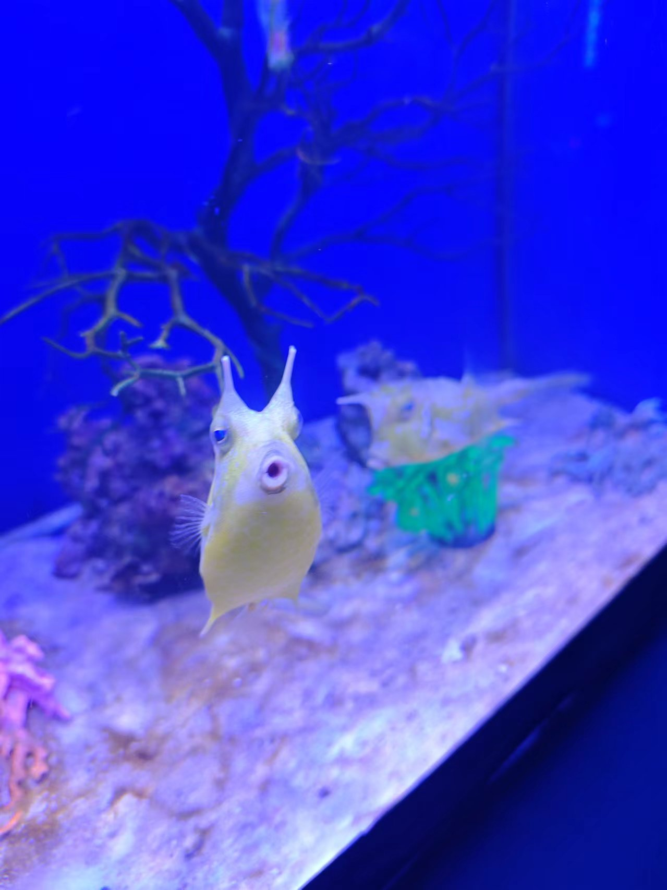
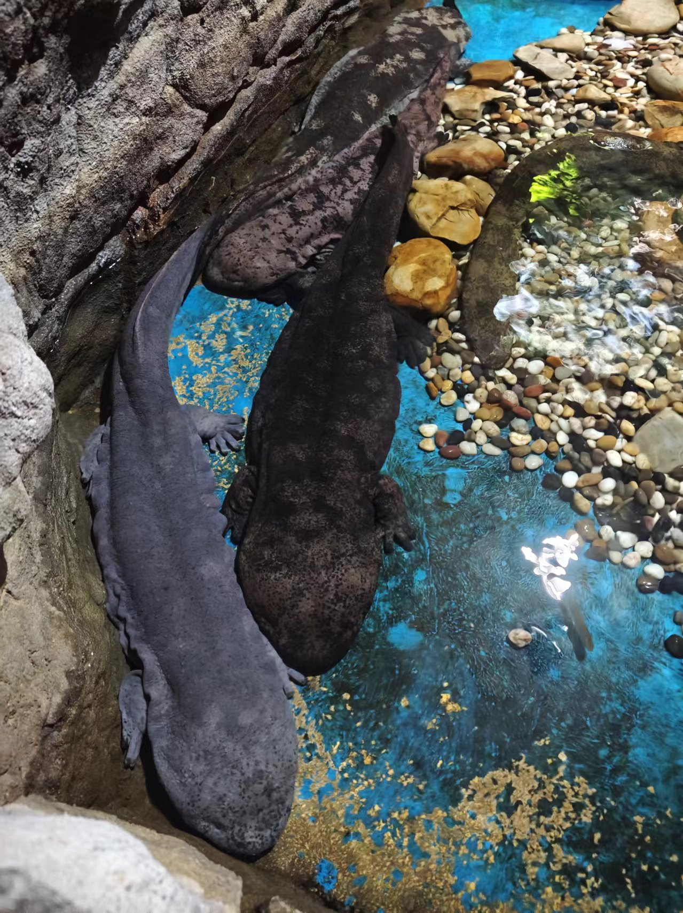
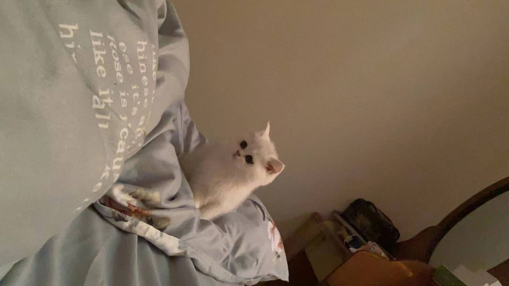
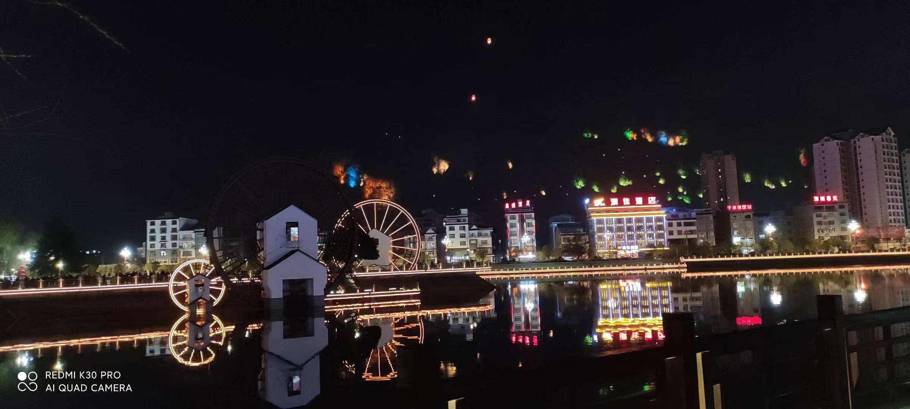

```c
#define MY_NAME "Wang GuoFu"

void main(int argc, char *argv[]) {
    printf("Hello, I am %s", MY_NAME);
}
```

## 🧑‍💻 简历

<table>
    <tbody>
        <tr>
            <td><b>姓名：</b></td>
            <td>Wang GuoFu</td>
            <td><b>性别：</b></td>
            <td>男</td>
            <td><b>网名</b></td>
            <td>CPoet <span style="font-size: 0.6em;">(曾用：asorb、llzero54)</span></td>
        </tr>
        <tr>
            <td><b>座右铭：</b></td>
            <td colspan="5"><span style="color: #569cd6;"> 心中若无梦，又何以致远！</span></td>
        </tr>
        <tr>
            <td><b>邮箱地址：</b></td>
            <td colspan="5"><a href="mailto:llzero54@foxmail.com">llzero54@foxmail.com</a></td>
        </tr>
        <tr>
            <td><b>就职企业：</b></td>
            <td colspan="3">北京中科江南信息技术股份有限公司</td>
            <td><b>职位：</b></td>
            <td>码农</td>
        </tr>
    </tbody>
</table>

## 💘 照片墙

### 20240505 （贵阳）




### 20220503 （镇宁）


### 20220412 （六枝）



### 20210219 （施秉）



