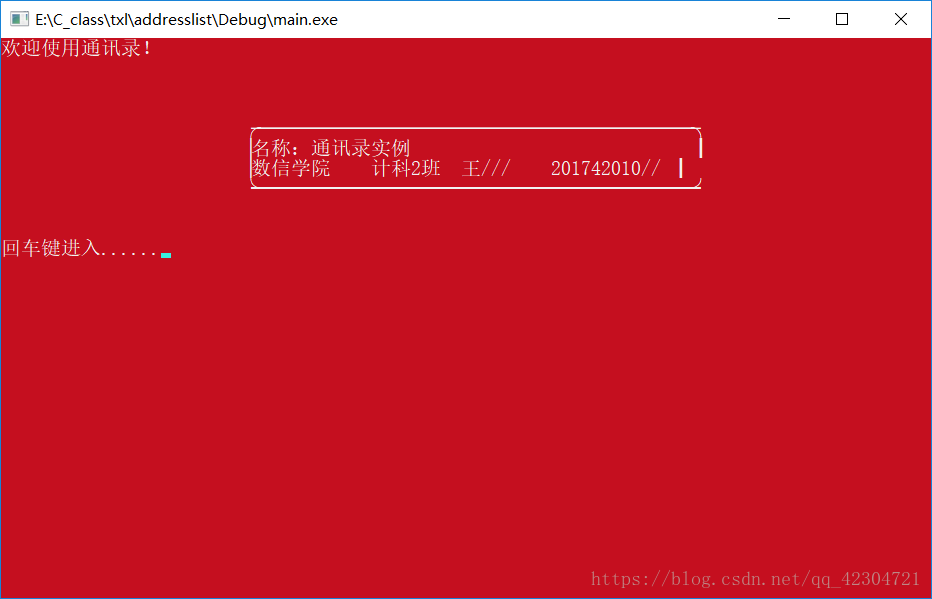
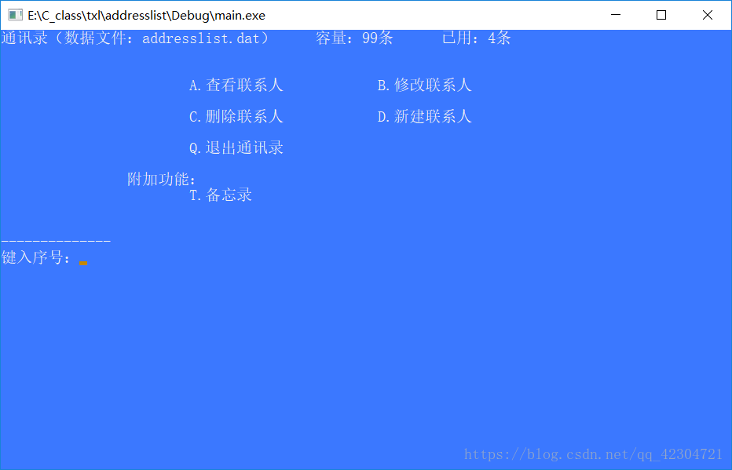
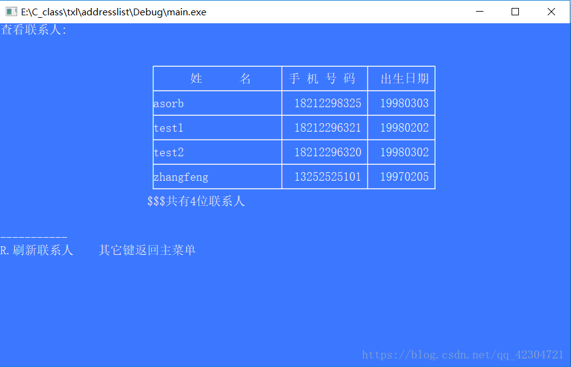

+++
draft = false
author = "CPoet"
title = "C语言通讯录实例"
date = "2018-08-09T23:30:31+08:00"
description = ""
tags = []
categories = [
    "coding/c",
]
image = "20180809120111917.png"
+++

## 前言

> 利用C语言简单写的一个通讯录实例，因为要交的原因，所以在编写的时候也是寥寥收场。主要实现的就是添加、删除、修改联系人，然后把数据写入存储文件。编写环境VS2013，测试环境DEVC++。**在VC++中是不能编译的，VC会报错的原因是在编写的时候在循环中添加局部变量，正好VC不支持这样的局部变量，如果有需要的同学可以把变量的声明提到函数主体前，这样VC是可以正常编译的。**

## 实现

```c
代码：
/*
**通讯录
**ASorb time:201807
*/
#include<stdio.h>
#include<stdlib.h>
#include<string.h>
#define max_list 99		//联系人最高条目
#define max_notes 45	//记事本条目
#define data_file "addresslist.dat"		//数据文件
#define notes_file "notes_data.txt"		//记事本数据
#define address_n address_num()			//统计函数
//定义全局结构体变量
typedef struct address{
	char name[20];
	char phone[12];
	char birthday[9];
}address;
//定义记事本结构体
typedef struct notes{
	char title[40];
	char content[200];
}notes;
//欢迎页面
void welcome(){
	system("color 4F");
	printf("欢迎使用通讯录！\n\n\n\n");
	printf("\t\t\t╭────────────────────────────────────────────╮\n");
	printf("\t\t\t│名称：通讯录实例                            ┃\n");
	printf("\t\t\t│数信学院    计科2班  王///    201742010// ┃\n");
	printf("\t\t\t╰━━━━━━━━━━━━━━━━━━━━━━━━━━━━━━━━━━━━━━━━━━━━╯\n");
	printf("\n\n回车键进入......");
	fflush(stdin);		//强制清除缓存流
	getchar();
}
//主界面
char interphase(){
	int address_num();		//声明统计函数
	char home;
	system("color 9F");
	printf("通讯录（数据文件：%s）\t容量：%d条\t已用：%d条\n\n\n",data_file, max_list, address_n);
	printf("\t\t\tA.查看联系人\t\tB.修改联系人\n\n");
	printf("\t\t\tC.删除联系人\t\tD.新建联系人\n\n");
	printf("\t\t\tQ.退出通讯录\n\n\t\t附加功能：\n\t\t\tT.备忘录\n\n\n");
	printf("--------------\n键入序号：");
	fflush(stdin);
	home = getchar();
	if ((home<'A' || home>'D') && home != 'Q'&&home != 'T') {
		system("cls");
		printf("提示：选择有误，重新选择！\n");
		interphase();
	}
	else
	return home;
}
//检查文件
void file_true(){
	address arr[2] = { { "test1", "18212296321", "19980202" }, { "test2", "18212296320", "19980302" }};		//定义两条测试数据
	FILE *data = fopen(data_file, "rb");
	if (data == NULL){
		data = fopen(data_file, "wb");
		fwrite(arr, sizeof(address),2, data);		//写入测试数据
	}
	fclose(data);		//关闭文件
}
//读取文件
void file_read(address *p){
	FILE *data = fopen(data_file, "rb");
	fread(p, sizeof(address), max_list, data);
	fclose(data);
}
//写入文件
void file_write(address *p){
	int count = 0;
	while (((p + count)->name[0]) != NULL){
		count++;
	}
	FILE *data = fopen(data_file, "wb");
	fwrite(p, sizeof(address), count, data);
	fclose(data);
}
//查看联系人
void address_list(){
	int address_num();
	address list[max_list] = {0};
	static int num = 0;
	char h_1;
	file_read(list);
	printf("查看联系人:\n\n\n");
	int i = 0;
	printf("\t\t\t┌────────────────────┬─────────────┬──────────┐\n");
	printf("\t\t\t│      姓      名    │ 手 机 号 码 │  出生日期│\n");
	for (int i = 0; (i < max_list) && (list[i].name[0] != NULL); i++){
		printf("\t\t\t├────────────────────┼─────────────┼──────────┤\n");
		printf("\t\t\t│%-20s│%13s│%10s│\n", list[i].name, list[i].phone, list[i].birthday);
	}
	printf("\t\t\t└────────────────────┴─────────────┴──────────┘\n");
	printf("\t\t\t$$$共有%d位联系人\n", address_num());
	printf("\n\n-----------\nR.刷新联系人\t其它键返回主菜单\n");
	fflush(stdin);
	h_1 = getchar();
	if (h_1 == 'R'){
		system("cls");
		printf("第%d次刷新！", ++num);
		address_list();
	}
}
//修改联系人
void address_edit(){
	address user;
	address list[max_list] = { 0 };
	char h_1 = NULL;
	file_read(list);
	printf("\n-------------\n输入姓名：");
	fflush(stdin);
	gets(user.name);
	for (int i = 0; (i < max_list) && list[i].name[0] != NULL; i++){
		if (strcmp(list[i].name, user.name) == 0){
			printf("输入新名字（为空不做修改）：");
			fflush(stdin);
			gets(user.name);
			printf("输入新号码（为空不做修改）：");
			fflush(stdin);
			gets(user.phone);
			printf("输入出生日期（为空不做修改）：");
			fflush(stdin);
			gets(user.birthday);
			if (strlen(user.name) > 0){
				strcpy(list[i].name, user.name);
				h_1 = 'Y';
			}
			if (strlen(user.phone) > 0){
				strcpy(list[i].phone, user.phone);
				h_1 = 'Y';
			}
			if (strlen(user.birthday) > 0){
				strcpy(list[i].birthday, user.birthday);
				h_1 = 'Y';
			}
			break;
		}
	}
	if (h_1 == 'Y'){
		file_write(list);
		system("cls");
		printf("联系人修改成功！");
		address_list();
	}
	else{
		printf("修改失败,任意键返回!\n");
		fflush(stdin);
		getchar();
	}
}
//删除联系人
void address_del(){
	int address_num();
	address user;
	address list[max_list] = { NULL };
	char h_1 = NULL;
	file_read(list);
	printf("\n-----------------\n输入姓名：");
	fflush(stdin);
	gets(user.name);
	for (int i = 0; (i < max_list) && list[i].name[0] != NULL; i++){
		if (strcmp(list[i].name, user.name) == 0) {
			for (i; (i < max_list - 1) && list[i + 1].name[0] != NULL; i++){
				list[i] = list[i + 1];
			}
			list[i].name[0] = NULL;
			h_1 = 'Y';
			break;
		}
	}
	if (h_1 == 'Y'){
		file_write(list);
		system("cls");
		printf("联系人删除成功！");
		address_list();
	}
	else{
		printf("删除失败,任意键返回!\n");
		fflush(stdin);
		getchar();
	}
}
//新建联系人
void address_new(){
	int address_num();
	int address_num_1 = address_num();
	address user;
	address list[max_list] = { NULL };
	char h_1 = NULL;
	printf("\n----------------\n输入姓名（20字符内）：");
	fflush(stdin);
	gets(user.name);
	printf("输入手机号码（11位）：");
	fflush(stdin);
	gets(user.phone);
	printf("输入出生日期（如：19980202）：");
	fflush(stdin);
	gets(user.birthday);
	if (strlen(user.name) <= 0 || strlen(user.name) > 20)
		printf("错误1：姓名不符合规定！");
	else if (strlen(user.phone) != 11)
		printf("错误2：手机号不正确！");
	else if (strlen(user.birthday) != 8)
		printf("错误3：出生日期格式错误！");
	else{
		file_read(list);
		//重排联系人
		for (int i = 0; i < address_num_1; i++){
			if (strcmp(user.name, list[i].name)<0){
				for (int ii = address_num_1; ii > i; ii--)
					list[ii] = list[ii - 1];
				list[i] = user;
				h_1 = 'Y';
				break;
			}
			else if (i == address_num_1 - 1){
				list[address_num_1] = user;
				h_1 = 'Y';
			}
		}
	}
	if (h_1 == 'Y'){
		file_write(list);
		system("cls");
		printf("新建联系人成功！");
		address_list();
	}
	else{
		printf("新建失败,任意键返回!\n");
		fflush(stdin);
		getchar();
	}
}
//统计条目
int address_num(){
	int num = 0;
	address list[max_list] = { NULL };
	file_read(list);
	for (num; (num < max_list) && list[num].name[0] != NULL; num++);
	return num;
}
//附加记事本功能&界面
void notes_interphase(){
	int notes_num();
	void add_notes();
	void view_notes();
	char h_1;
	while (1){
		printf("记事本(数据文件%s)\t容量：%d\t已用：%d\n",notes_file, max_notes, notes_num());
		printf("\n\n\t\t\tA.记事\t\tB.查看\n\n\t\t\tQ.返回上一级\n\n");
		printf("\n----------------\n键入序号：");
		fflush(stdin);
		h_1 = getchar();
		if (h_1 == 'A')
			add_notes();
		else if (h_1 == 'B')
			view_notes();
		else if (h_1 == 'Q')
			break;
		else{
			system("cls");
			printf("提示：选择有误，重新选择！\n");
			notes_interphase();
		}
	}
}
//记事文件读取
void notes_read(notes *p){
	FILE *data = fopen(notes_file,"rb");
	if (data == NULL)		//文件不存在
		data = fopen(notes_file, "wb+");
	fread(p, sizeof(notes), max_notes, data);
	fclose(data);
}
//记事本文件存储
void notes_save(notes *p){
	int count = 0;
	FILE *data = fopen(notes_file, "wb");
	while ((p + count)->title[0] != NULL)
		count++;
	fwrite(p, sizeof(notes), count, data);
	fclose(data);
}
//记事
void add_notes(){
	int notes_num();
	notes new_notes;
	notes list[max_notes] = { NULL };
	printf("\n--------------\n题目：");
	fflush(stdin);
	gets(new_notes.title);
	printf("正文：");
	fflush(stdin);
	gets(new_notes.content);
	if ((strlen(new_notes.title) > 0) && (strlen(new_notes.content) > 0)){
		notes_read(list);
		list[notes_num()] = new_notes;
		notes_save(list);
		system("cls");
		printf("提示：保存成功！\n");
	}
	else{
		system("cls");
		printf("提示：内容有误，保存失败！\n");
	}
}
//查看记事本
void view_notes(){
	int notes_num(),i,link;
	char view, h_1 = NULL;
	notes list[max_notes] = { NULL };
	notes_read(list);
	system("cls");
	printf("查看记事本\n\n");
	printf("\t\t\t\t%5s\t%-40s", "序号", "题目\n");
	for (int i = notes_num(), ii = 0; i > 0; i--, ii++)
		printf("%d \t% -40s\n", ii, list[ii].title);
	printf("\n总数目：%d\tD.删除\tR.阅读\n",notes_num());
	printf("\n--------------\n键入操作：");
	fflush(stdin);
	view = getchar();
	printf("输入序号：");
	scanf("%d", &link);
	if (view == 'D'){
		if (link >= 0 && link < notes_num()){
			for (i = link; (i < max_list - 1) && list[i + 1].title[0] != NULL; i++){
				list[i] = list[i + 1];
			}
			list[i].title[0] = NULL;
			h_1 = 'Y';
		}
		if (h_1 == 'Y'){
			notes_save(list);
			system("cls");
			printf("提示：删除成功！\n");
		}
		else{
			system("cls");
			printf("提示：操作有误，返回上级！\n");
		}
	}
	else if (view == 'R'){
		printf("------------\n正在阅读《%s》\n", list[link].title);
		printf("正文：%s", list[link].content);
		printf("\n\n$$2018 任意键返回！");
		fflush(stdin);
		getchar();
		system("cls");
	}
	else{
		system("cls");
		printf("提示：操作有误，返回上级！\n");
	}
}
//记事本统计函数
int notes_num(){
	int num = 0;
	notes list[max_notes] = { NULL };
	notes_read(list);
	for (num; (num < max_notes) && list[num].title[0] != NULL; num++);
	return num;
}
int main(){
	system("mode con cols=93 lines=28");		//初始化窗口大小
	file_true();
	char h_1;
	welcome();
	while (1){
		system("cls");
		h_1 = interphase();
		if (h_1 == 'Q')
			break;
		else{
			switch (h_1){
			case 'A':
				system("cls"); address_list(); break;
			case 'B':
				address_edit(); break;
			case 'C':
				address_del(); break;
			case 'D':
				address_new(); break;
			case 'T':
				system("cls"); notes_interphase(); break;
			}
		}
	}
return 0;
}
```

## 效果

下面提供一些效果图：







## 下载

DEVC++运行源代码下载：[https://download.csdn.net/download/qq_42304721/10592956](https://download.csdn.net/download/qq_42304721/10592956)
