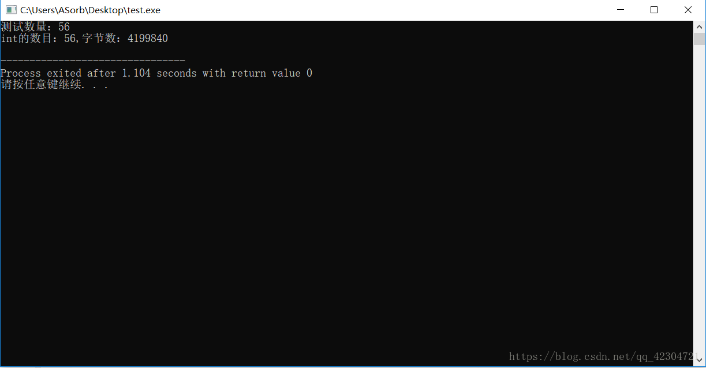

+++
draft = false
author = "CPoet"
title = "C语言读取文件大小，载入文件全部内容"
date = "2018-08-09T23:39:08+08:00"
description = ""
tags = []
categories = [
    "coding/c",
]
+++
## 前言

在编写程序的时候，大多数需要对文件进行操作。虽然C语言函数库提供了一些对文件操作的函数，但是对于一些新手来说。如何读取文件是一个大的问题，如果只是简单的从文件中读取一个字符，可以使用getc函数读取。可是在读取一段或者整个文件的内容时，很多人都不知道如何下手，下面就简单的说说如何使用C语言读取整个文件的内容。

**（对C基本掌握的人都知道fgets函数可以从文件中读取n个字节的数据，但是fgets存在一个弊端，那就是当读取遇见换行符时就会截至，这可能会导致我们不能获得想要的数据。如果有很多的数据的话，使用fgets读取出来不便于我们查找和操作。所以数据文件我们更多的是使用二进制存储。然后使用fread进行读取操作，这样读取的数据具有一定的格式和结构方便于我们的操作。如果想知道更多更详细的文件操作方法，可以关注博客或者想博主提问）。**

## 实现

> 注意：引入的头文件为stdio.h

1. 写测试文件

```c
//写入文件
void file_w(int n) {
	int i=0,p[100];
	FILE *data;
	for (i; i<n; i++,p[i]=i+2);
	data=fopen("test.orb","wb");
	fwrite(p,sizeof(int),n,data);
	fclose(data);
}
```

2. 简单获取文件的字节数

```c
//返回文件的字节数 
int int_num() {
	int t;
	FILE *data=fopen("test.orb","rb");
	fseek(data,0L,2);
	t=ftell(data);
	fclose(data);
	return t;
}
```

3. 主函数

```c
int main() {
	int n;
	printf("测试数量：");
	scanf("%d",&n);
	file_w(n);
	printf("int的数目：%d,字节数：%d\n",int_num()/sizeof(int),int_num);
	return 0;
}
```

## 效果图




> 在获取文件的字节大小后，我们可以除以变量类型的字节数，然后通过calloc开辟同样大小的空间载入数据，在通过fread进行读取。这样就可以把整个文件的数据读取出来。
