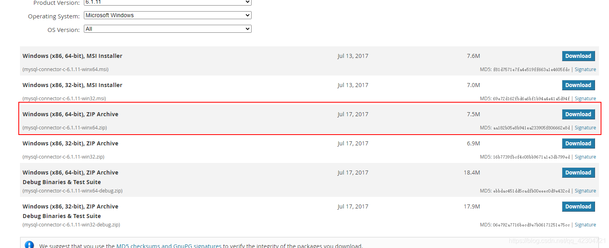

+++
draft = false
author = "CPoet"
title = "pip安装mysqliclient报错  fatal error C1083: 无法打开包括文件: “mysql.h”: No such file or directory"
date = "2020-10-16T22:14:59+08:00"
description = "PIP安装mysqliclient报错问题"
tags = ["Python", "Pip"]
categories = [
    "coding/python",
]
image = "20201016104707626.png"
+++

# pip安装mysqliclient报错  fatal error C1083: 无法打开包括文件: “mysql.h”: No such file or directory
> 出现这个错误的原因是本地没有配置`mysql-connector-c`的path，也就是说mysqlclient依赖的头文件是lib库没有找到。\
**注意：我本地安装的是visual studio 2019**


1. 下载mysql-connector的c语言api  

下载地址：[https://downloads.mysql.com/archives/c-c/](https://downloads.mysql.com/archives/c-c/) 



我下载的是`Windows (x86, 64-bit), ZIP Archive`版，如果下载`MSI Installer`安装版，可以直接安装以省去下面的步骤。

2. 解压缩后把`include`的所有头文件复制到`Visual studio`的MSVC编译器的include中


3. 把`mysqlclient.lib`更名为`mariadbclient.lib`，然后把mariadbclient.lib复制到MSVC的lib中（由于我的是64bit，因此我放在x64中）

**需要注意自己的路径**


4. 安装`mysqlclient`

```shell
pip install -U mysqlclient
```


**Successfully!!!!**
