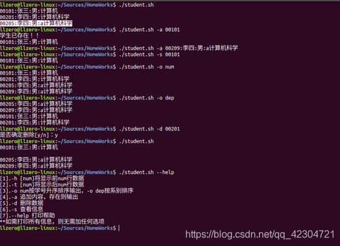

+++
draft = false
author = "CPoet"
title = "使用shell编写“学生成绩管理系统“，按照要求完成相应的功能。"
date = "2020-11-15T21:29:13+08:00"
description = "大学期间按要求使用Shell实现的学生成绩管理系统"
tags = ["Linux", "Shell"]
categories = [
    "coding/shell",
]
image = "20201115194746955.png"
+++

## 功能要求

- [x] 当输入student.sh时，输出文件的全部内容
- [x] 当输入student.sh –h 5时，输出文件的前5条记录;当输入student.sh -t 5时，输出文件的最后5条记录;
- [x] 当输入student.sh –o num，输出文件的全部内容,并按学号升序排序;输入student.sh -o dep，输出文件的全部内容,并按系别排序;
- [x] 当输入student.sh -a 00101:张三:男:计算机 时，首先判断00101记录是否存在;如果存在，则给出提示，并输出文件中学号为00101的该行信息;如果不存在，判断该行信息是否符合格式要求(各个字段不能为空;学号必须是5个数字;性别的取值只能是”男”和”女”）,如果不符合要求，则提示用户信息格式不对;否则把该信息写入文件student.txt。
- [x] 当输入student.sh -d 00101(或student.sh - d 张三）时，首先判断00101（或张三）记录是否存在，如果不存在，给出提示;如果存在，显示该行信息并提示用户确认是否要删除记录，如用户输入y或者yes，则删除文件中学号为00101的该行信息，如果用户输入n或no时，则不做删除操作
- [x] 当输入student.sh -s 00101(或student.sh -s 张三）时，首先判断00101(或张三）记录是否存在，如果不在，给出提示，如果存在，则输出文件中00101（或张三）的该行信息
- [x] 当输入student.sh --help时;输出该shell的用法
- [x] 当用户输入的选项不正确时，给出错误提示，并输出该shell的用法（如:student.sh -q 123456 需错误提示)

## 实现代码

```shell
#!/bin/bash

# 简单学生成绩管理系统
# -- linux 系统课程作业
# -- By llZero
# -- 2020年11月

# final 
_TRUE=1
_FALSE=0

# 数据文件名称
DATA_FILE_NAME='student.txt'

# 判断数据格式是否符合要求
function fun_test_data_format {
    if test 1 -eq `echo $1|grep -c -e '^[0-9]\{5\}:[^:]\{1,\}:[男女]:[^:]\{1,\}$'`
    then
        return $_TRUE
    fi
    return $_FALSE
}

# 个性化输出
function echo_erro {
    echo -e "\033[31m $1 \033[0m"
}
function echo_info {
    echo $1
}

# 打印帮助
function fun_show_help {
    echo_info '[1].-h [num]将显示前num行数据'
    echo_info '[2].-t [num]将显示后num行数据'
    echo_info '[3].-o num按学号升序排序输出，-o dep按系别排序'
    echo_info '[4].-a 追加内容，存在则输出'
    echo_info '[5].-d 删除数据'
    echo_info '[6].-s 查看信息'
    echo_info '[7].--help 打印帮助'
    echo_info '**如需打印所有信息，则无需加任何选项'
}

# 判断数据文件是否存在
# 存在则判断数据文件的正确性
# 不存在则会初始化一个文件
if [ -f $DATA_FILE_NAME ]
then
    for line in `cat $DATA_FILE_NAME`
    do
        fun_test_data_format $line
        if test $_TRUE -ne $?
        then
            echo_erro '已存在的数据格式不正确，建议删除已有的错误文件！'
            exit
        fi
    done
else
    echo_info '数据文件不存在，自动创建'
    echo '00101:张三:男:计算机' > $DATA_FILE_NAME
fi

# 功能选择
case $1 in
    '-h')
        if test -z "$2"
        then
            head $DATA_FILE_NAME
        else
            head -n $2 $DATA_FILE_NAME
        fi
    ;;
    '-t')
        if test -z "$2"
        then
            tail $DATA_FILE_NAME
        else
            tail -n $2 $DATA_FILE_NAME
        fi
    ;;
    '-o')
        if test $2 == 'num'
        then
            sort --field-separator=":" --key=1 $DATA_FILE_NAME
        else
            sort --field-separator=":" --key=4 $DATA_FILE_NAME
        fi
    ;;
    '-a')
        if test -n "$2"
        then
            student_id=`echo $2|cut -d ':' -f 1`
            if test 1 -eq `grep -c -e "^$student_id:" $DATA_FILE_NAME`
            then
                echo_info '学生已存在！！'
                echo_info `grep -m 1 -e "^$student_id:" $DATA_FILE_NAME`
            else
                fun_test_data_format $2
                if test $_TRUE -eq $?
                then
                    echo $2 >> $DATA_FILE_NAME
                else
                    echo_erro '输入的学生信息格式不符合要求！'
                fi
            fi
        else
            echo_erro '信息不完整'
        fi  
    ;;
    '-d')
        if test -n "$2"
        then
            if test 1 -eq `grep -c -e "^$2:" $DATA_FILE_NAME`
            then
                read -p '是否确定删除[y/n]：' input
                if test $input == 'yes' -o $input == 'y'
                then
                    sed -i "/^$2:/g" $DATA_FILE_NAME
                fi
            else
                echo_erro '学生信息不存在'
            fi
        else
            echo_erro '缺少学号'
        fi
    ;;
    '-s')
        if test -n "$2"
        then
            if test 1 -eq `grep -c -e "^$2:" $DATA_FILE_NAME`
            then
                echo_info `grep -m 1 -e "^$2:" $DATA_FILE_NAME`
            else
                echo_erro '学生信息不存在'
            fi
        else
            echo_erro '缺少学号'
        fi
    ;;
    '--help')
        fun_show_help
    ;;
    '')
        cat $DATA_FILE_NAME
    ;;
    *)
        echo_erro '参数选项错误，--help查看帮助'
	echo_info '------------------------------'
	fun_show_help
    ;;
esac

```

## 效果截图



