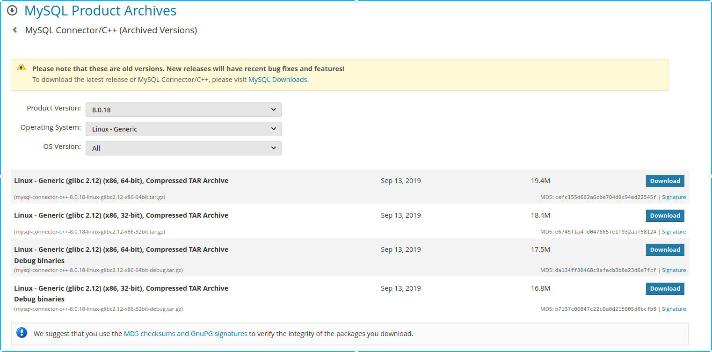
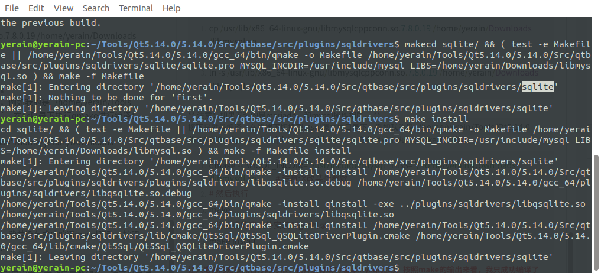
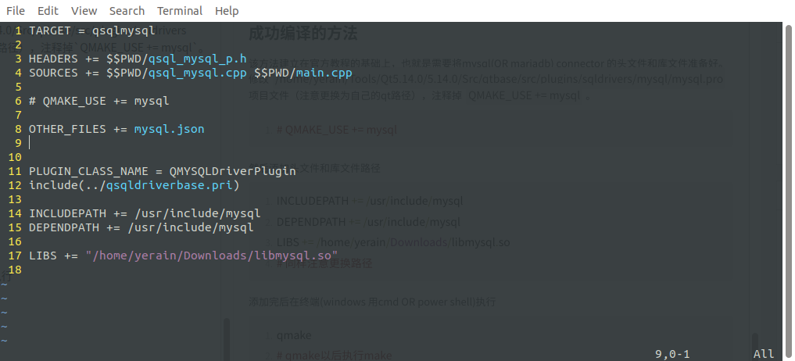
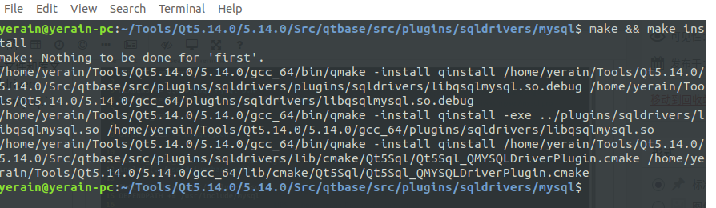
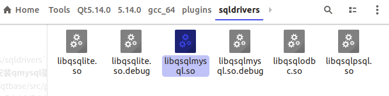
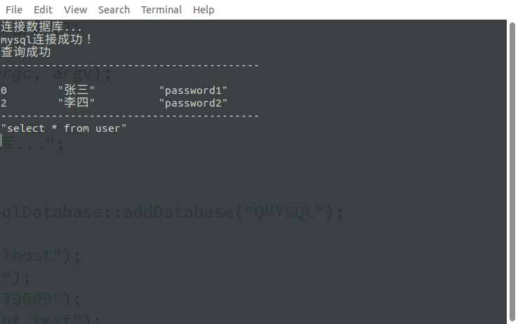

+++
draft = false
author = "CPoet"
title = "QT编译Mysql驱动(Mariadb驱动),解决qmake报错问题"
date = "2020-02-09T23:14:20+08:00"
description = ""
tags = ["QT", "MySQL", "Mariadb"]
categories = [
    "framework/qt",
]
image = "aHR0cHM6Ly93d3cueWVyYWluLmNuL3dwLWNvbnRlbnQvdXBsb2Fkcy8yMDIwLzAyL0RlZXBpblNjcmVlbnNob3Rfc2VsZWN0LWFyZWFfMjAyMDAyMDkxODE2NTIucG5n.png"
+++

## 编译环境
1. 系统：Ubuntu18.04
2. QT版本：Qt 5.14.0
3. gcc版本：gcc version 7.5.0

## qt官方编译驱动方式
在使用QT连接数据库时遇见的第一个错误就是`QMYSQL driver not loaded`，显然这是缺少mysql的驱动。我们需要手动编译mysql的驱动，qt官方给出的编译教程如下：

细看访问qt网站：[https://doc.qt.io/qt-5/sql-driver.html](https://doc.qt.io/qt-5/sql-driver.html)

```python
C:\Qt5\5.13.2\Src\qtbase\src\plugins\sqldrivers>qmake -version
QMake version 3.1
Using Qt version 5.13.2 in C:/Qt5/5.13.2/mingw73_64/lib
C:\Qt5\5.13.2\Src\qtbase\src\plugins\sqldrivers>qmake -- MYSQL_INCDIR="C:/Program Files/MySQL/MySQL Connector C 6.1/include" MYSQL_LIBDIR="C:/Program Files/MySQL/MySQL Connector C 6.1/lib"
Info: creating stash file C:\Qt5\5.13.2\Src\qtbase\src\plugins\sqldrivers\.qmake.stash

Running configuration tests...
Checking for DB2 (IBM)... no
Checking for InterBase... no
Checking for MySQL... yes
Checking for OCI (Oracle)... no
Checking for ODBC... yes
Checking for PostgreSQL... no
Checking for SQLite (version 2)... no
Checking for TDS (Sybase)... no
Done running configuration tests.

Configure summary:

Qt Sql Drivers:
  DB2 (IBM) .............................. no
  InterBase .............................. no
  MySql .................................. yes
  OCI (Oracle) ........................... no
  ODBC ................................... yes
  PostgreSQL ............................. no
  SQLite2 ................................ no
  SQLite ................................. yes
    Using system provided SQLite ......... no
  TDS (Sybase) ........................... no

Qt is now configured for building. Just run 'mingw32-make'.
Once everything is built, you must run 'mingw32-make install'.
Qt will be installed into 'C:\Qt5\5.13.2\mingw73_64'.

Prior to reconfiguration, make sure you remove any leftovers from the previous build.
```

按照官方的方法，我们需要找到自己mysql头文件和mysql链接库的位置。如果自己的电脑上没有则可以通过mysql网站下载（mariadb和mysql都是使用QMYSQL驱动，因此无论是下载mariadb或者mysql都可以）。如果系统是linux的用户可以通过安装mysql-dev，或者libmariadbclient-dev，不同的linux发行版其包也不同。

mysql connector下载地址：[https://downloads.mysql.com/archives/c-cpp/](https://downloads.mysql.com/archives/c-cpp/)



选择对应自己系统版本的包下载，因为我个人不喜欢麻烦，所以我选择ubuntu的x64deb包进行安装。安装以后需要找到头文件和库文件路径。例如我的是：

```python
/usr/include/mysql		# 头文件
/usr/lib/x86_64-linux-gnu/libmysqlcppconn.so.7.8.0.19		# 库文件
```

如果不知道确切位置，可以通过find进行搜索。

```python
find / mysql  2> /dev/null | grep mysql | grep h
find /mysql  2 > /dev/null | grep mysql | grep so
```

这时候需要把库文件复制到任意能找到的目录，并修改文件名为libmysql.so，也可以通过链接的方式。

```python
cp /usr/lib/x86_64-linux-gnu/libmysqlcppconn.so.7.8.0.19 /home/yerain/Downloads/libmysql.so
# OR
ln -s /usr/lib/x86_64-linux-gnu/libmysqlcppconn.so.7.8.0.19 /home/yerain/Downloads/libmysql.so
```

** 注意：如果安装的是mariadb，和mysql操作相同。**

接下来就是编译，在终端下切换到qtsql源文件目录下，例如我的是`/home/yerain/Tools/Qt5.14.0/5.14.0/Src/qtbase/src/plugins/sqldrivers`。在此目录下执行qmake进行编译：

```python
qmake -- MYSQL_INCDIR="/usr/include/mysql" LIBS="/home/yerain/Downloads/libmysql.so"		# 注意修改某些参数
# 然后执行
make
# 将生成的库文件安装到gcc目录
make install
```

<b style="color:red;"> 让人遗憾的是按照官方的方法，我并没有成功编译mysql驱动。按照make的输出来看，我只成功编译了sqlite的驱动。</b>



<b style="color:blue;">不过可能是我的环境问题，而且我引用官方原文教程只是希望多一种可以尝试的方法。</b>

## 成功编译的方法
该方法建立在官方教程的基础上，也就是需要将mysql(OR mariadb) connector 的头文件和库文件准备好。修改`/home/yerain/Tools/Qt5.14.0/5.14.0/Src/qtbase/src/plugins/sqldrivers/mysql/mysql.pro`项目文件（注意更换为自己的qt路径），注释掉`QMAKE_USE += mysql`。

```python
# QMAKE_USE += mysql
```

然后添加头文件和库文件路径

```python
INCLUDEPATH += /usr/include/mysql
DEPENDPATH += /usr/include/mysql
LIBS += /home/yerain/Downloads/libmysql.so
# 同样注意更换路径
```


添加完后在终端(windows 用cmd OR power shell)执行

```python
qmake
# qmake以后执行
make && make install
```



编译完成以后即可在`/home/yerain/Tools/Qt5.14.0/5.14.0/gcc_64/plugins/sqldrivers`中看到增加的libqsqlmysql.so和libqsqlmysql.so.debug文件，这代表已经**成功安装qmysql驱动。**（如果找不到，可以检查`/home/yerain/Tools/Qt5.14.0/5.14.0/Src/qtbase/src/plugins/sqldrivers/plugins/sqldrivers`下是否有这两个文件，有的话直接复制到`Qt5.14.0/5.14.0/gcc_64/plugins/sqldrivers`下即可）。



## 测试

测试代码：

```cpp
    /* QT连接数据库测试 */
    qDebug() << "连接数据库...";

    // 连接mysql
    QSqlDatabase db = QSqlDatabase::addDatabase("QMYSQL");

    db.setHostName("localhost");
    db.setUserName("root");
    db.setPassword("123456789");
    db.setDatabaseName("qt_test");

    if(!db.open()){
        qDebug() << "mysql连接失败！ => " << db.lastError().text();
        exit(0);        // 连接失败退出程序
    }

    qDebug() << "mysql连接成功！";

    QSqlQuery query(db);
    if(!query.exec("select * from user")){
        qDebug() << "查询失败 => " << query.lastError();
        exit(0);
    }

    qDebug() << "查询成功";
    qDebug() << "-----------------------------------------" << endl;
//    qDebug() << "ID" << "\tname" << "\tpassword";
    while(query.next()){
        qDebug() << query.value(0).toInt() << "\t"
                 << query.value(1).toString() << "\t"
                 << query.value(2).toString();
    }
    qDebug() << "-----------------------------------------";
    qDebug() << query.lastQuery();
    db.close();
```

结果：



## 结语
如果vim或者没有合适的编辑器的话，可以直接使用QT Create打开.pro项目文件，然后右键编译需要编译的项目即可。
