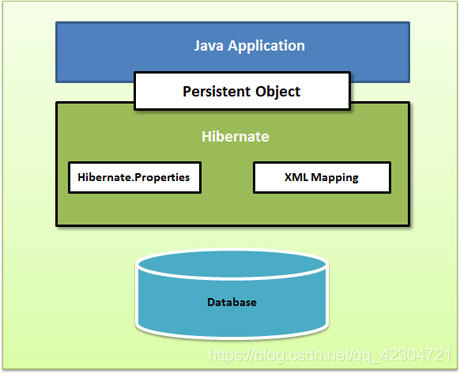

+++
draft = false
author = "CPoet"
title = "Hibernate入门篇 - ORM真香"
date = "2020-10-06T22:50:48+08:00"
description = "个人Hibernate (Spring Data JPA) 入门整理"
tags = ["Spring", "Hibernate", "Spring-Data-Jpa"]
categories = [
    "framework/spring",
]
+++

## Hibernate架构

Hibernate架构图：




Hibernate 使用不同的现存 Java API，比如 JDBC，Java 事务 API（JTA），以及 Java 命名和目录界面（JNDI）。JDBC 提供了一个基本的抽象级别的通用关系数据库的功能， Hibernate 支持几乎所有带有 JDBC 驱动的数据库。JNDI 和 JTA 允许 Hibernate 与 J2EE 应用程序服务器相集成。

### 配置对象

配置对象是你在任何 Hibernate 应用程序中创造的第一个 Hibernate 对象，并且经常只在应用程序初始化期间创造。它代表了 Hibernate 所需一个配置或属性文件。配置对象提供了两种基础组件。

- **数据库连接**：由 Hibernate 支持的一个或多个配置文件处理。这些文件是 **hibernate.properties** 和 **hibernate.cfg.xml**。
- **类映射设置**：这个组件创造了 Java 类和数据库表格之间的联系。

### SessionFactory对象

配置对象是你在任何 Hibernate 应用程序中创造的第一个 Hibernate 对象，并且经常只在应用程序初始化期间创造。它代表了 Hibernate 所需一个配置或属性文件。配置对象提供了两种基础组件。

- **数据库连接**：由 Hibernate 支持的一个或多个配置文件处理。这些文件是 **hibernate.properties** 和 **hibernate.cfg.xml**。
- **类映射设置**：这个组件创造了 Java 类和数据库表格之间的联系。

### Session对象

配置对象是你在任何 Hibernate 应用程序中创造的第一个 Hibernate 对象，并且经常只在应用程序初始化期间创造。它代表了 Hibernate 所需一个配置或属性文件。配置对象提供了两种基础组件。

- **数据库连接**：由 Hibernate 支持的一个或多个配置文件处理。这些文件是 **hibernate.properties** 和 **hibernate.cfg.xml**。
- **类映射设置**：这个组件创造了 Java 类和数据库表格之间的联系。

### Transaction对象

配置对象是你在任何 Hibernate 应用程序中创造的第一个 Hibernate 对象，并且经常只在应用程序初始化期间创造。它代表了 Hibernate 所需一个配置或属性文件。配置对象提供了两种基础组件。

- **数据库连接**：由 Hibernate 支持的一个或多个配置文件处理。这些文件是 **hibernate.properties** 和 **hibernate.cfg.xml**。
- **类映射设置**：这个组件创造了 Java 类和数据库表格之间的联系。

### Query对象

Query 对象使用 SQL 或者 Hibernate 查询语言（HQL）字符串在数据库中来检索数据并创造对象。一个查询的实例被用于连结查询参数，限制由查询返回的结果数量，并最终执行查询。

### Criteria

Criteria 对象被用于创造和执行面向规则查询的对象来检索对象。可以利用该类来完成非sql语句的数据过滤查询。

## 引入Hibernate

### 手动引入

在Hibernate官网[http://hibernate.org/orm/releases/](http://hibernate.org/orm/releases/)下载合适版本的资料，其中包括hibernate的源码、编译好的jar包和文档信息。

对于普通使用只需要把`lib\required`目录下的jar包引入项目，对于缓存的使用，需要引入`lib\optional\ehcache`目录下的`EHCache`的jar包。

### maven

hibernate包

```xml
<dependency>
    <groupId>org.hibernate</groupId>
    <artifactId>hibernate-core</artifactId>
    <version>5.4.21.Final</version>
</dependency>
```

缓存Ehcache

```xml
<dependency>
    <groupId>org.hibernate</groupId>
    <artifactId>hibernate-ehcache</artifactId>
    <version>5.4.21.Final</version>
</dependency>
```

Hibernate6目前还处于测试版。

**使用之前还需要引入对应自己DataBase的JDBC驱动。**

## hibernate.cfg.xml配置文件

`hibernate.cfg.xml`是hibernate配置文件的默认文件名，只需要将hibernate.cfg.xml文件放在项目目录下，hibernate将自动读取文件中的配置。(**对于普通的java项目，hibernate.cfg.xml应该放在src目录下**)

通常需要配置SQL方言、连接驱动、数据库url地址、用户名和密码等。可以使用`mapping`标签来指示映射文件路径，可以同hibernate的配置文件放在项目根目录下。

```xml
<?xml version="1.0" encoding="utf-8"?>
<!DOCTYPE hibernate-configuration SYSTEM
        "http://www.hibernate.org/dtd/hibernate-configuration-3.0.dtd">
<hibernate-configuration>
<!--    配置一个session工厂-->
    <session-factory>
<!--        sql方言-->
        <property name="hibernate.dialect">
            org.hibernate.dialect.MySQLDialect
        </property>

<!--        jdbc驱动-->
        <property name="hibernate.connection.driver_class">
            com.mysql.cj.jdbc.Driver
        </property>
        
<!--        数据库链接-->
        <property name="hibernate.connection.url">
            jdbc:mysql://localhost:3306/hibernate_study?serverTimezone=UTC
        </property>

<!--        用户名-->
        <property name="hibernate.connection.username">
            dev
        </property>

<!--        密码-->
        <property name="hibernate.connection.password">
            123456
        </property>

<!--        映射文件-->
        <!-- 支持package、class、file、jar -->
        <mapping resource="User.hbm.xml" />
    </session-factory>
</hibernate-configuration>
```

### 几个重要的配置属性

| NO   | **属性和描述**                                               |
| :--- | :----------------------------------------------------------- |
| 1    | **hibernate.connection.datasource**  <br/> 在应用程序服务器环境中您正在使用的应用程序 JNDI 名。 |
| 2    | **hibernate.jndi.class** <br />JNDI 的 InitialContext 类。   |
| 3    | **hibernate.jndi.<JNDIpropertyname>**  <br />在 JNDI的 InitialContext 类中通过任何你想要的 Java 命名和目录接口属性。 |
| 4    | **hibernate.jndi.url** <br /> 为 JNDI 提供 URL。             |
| 5    | **hibernate.connection.username** <br /> 数据库用户名。     |
| 6    | **hibernate.connection.password** <br /> 数据库密码。        |

### 数据库方言

| **数据库**                | **方言属性**                               |
| :------------------------ | :----------------------------------------- |
| DB2                       | org.hibernate.dialect.DB2Dialect           |
| HSQLDB                    | org.hibernate.dialect.HSQLDialect          |
| HypersonicSQL             | org.hibernate.dialect.HSQLDialect          |
| Informix                  | org.hibernate.dialect.InformixDialect      |
| Ingres                    | org.hibernate.dialect.IngresDialect        |
| Interbase                 | org.hibernate.dialect.InterbaseDialect     |
| Microsoft SQL Server 2000 | org.hibernate.dialect.SQLServerDialect     |
| Microsoft SQL Server 2005 | org.hibernate.dialect.SQLServer2005Dialect |
| Microsoft SQL Server 2008 | org.hibernate.dialect.SQLServer2008Dialect |
| MySQL                     | org.hibernate.dialect.MySQLDialect         |
| Oracle (any version)      | org.hibernate.dialect.OracleDialect        |
| Oracle 11g                | org.hibernate.dialect.Oracle10gDialect     |
| Oracle 10g                | org.hibernate.dialect.Oracle10gDialect     |
| Oracle 9i                 | org.hibernate.dialect.Oracle9iDialect      |
| PostgreSQL                | org.hibernate.dialect.PostgreSQLDialect    |
| Progress                  | org.hibernate.dialect.ProgressDialect      |
| SAP DB                    | org.hibernate.dialect.SAPDBDialect         |
| Sybase                    | org.hibernate.dialect.SybaseDialect        |
| Sybase Anywhere           | org.hibernate.dialect.SybaseAnywhereDialec |

## 简单的XML映射文件

所有的Entity应该是按照java bean的要求编写的POJO对象，以User Entity为例。

User Entity:

```java
package cn.llzero.entity;

import java.io.Serializable;

public class User implements Serializable {
    private Integer id;

    private String name;

    private String pass;

    private Character sex;

    public Integer getId() {
        return id;
    }

    public User setId(Integer id) {
        this.id = id;
        return this;
    }

    public String getName() {
        return name;
    }

    public User setName(String name) {
        this.name = name;
        return this;
    }

    public String getPass() {
        return pass;
    }

    public User setPass(String pass) {
        this.pass = pass;
        return this;
    }

    public Character getSex() {
        return sex;
    }

    public User setSex(Character sex) {
        this.sex = sex;
        return this;
    }

    @Override
    public String toString() {
        return "User{" +
                "id=" + id +
                ", name='" + name + '\'' +
                ", pass='" + pass + '\'' +
                ", sex=" + sex +
                '}';
    }
}
```

XML映射文件（User.hbm.xml）:

```xml
<?xml version="1.0" encoding="utf-8"?>
<!DOCTYPE hibernate-mapping PUBLIC
        "-//Hibernate/Hibernate Mapping DTD//EN"
        "http://www.hibernate.org/dtd/hibernate-mapping-3.0.dtd">
<hibernate-mapping>
    <class name="cn.llzero.entity.User" table="user">
        <meta attribute="description">
            User映射，学习Hibernate
        </meta>

        <id name="id" column="id" type="integer" >
            <generator class="native" />
        </id>

        <property name="name" column="name" unique="true" type="string" />

        <property name="pass" column="pass" type="string"/>

        <property name="sex" column="sex" type="char"/>
    </class>
</hibernate-mapping>
```

name => 对应实体的属性， column => 数据库字段， type指示了数据的类型，该属性建议使用hibernate的预设值。

### hibernate type预设值

当你准备一个 Hibernate 映射文件时，我们已经看到你把 Java 数据类型映射到了 RDBMS 数据格式。在映射文件中已经声明被使用的 **types** 不是 Java 数据类型；它们也不是 SQL 数据库类型。这种类型被称为 Hibernate 映射类型，可以从 Java 翻译成 SQL，反之亦然。

在这一章中列举出所有的基础，日期和时间，大型数据对象，和其它内嵌的映射数据类型。

#### 原始类型

| 映射类型    | Java 类型                    | ANSI SQL 类型        |
| :---------- | :--------------------------- | :------------------- |
| integer     | int 或 java.lang.Integer     | INTEGER              |
| long        | long 或 java.lang.Long       | BIGINT               |
| short       | short 或 java.lang.Short     | SMALLINT             |
| float       | float 或 java.lang.Float     | FLOAT                |
| double      | double 或 java.lang.Double   | DOUBLE               |
| big_decimal | java.math.BigDecimal         | NUMERIC              |
| character   | java.lang.String             | CHAR(1)              |
| string      | java.lang.String             | VARCHAR              |
| byte        | byte 或 java.lang.Byte       | TINYINT              |
| boolean     | boolean 或 java.lang.Boolean | BIT                  |
| yes/no      | boolean 或 java.lang.Boolean | CHAR(1) ('Y' or 'N') |
| true/false  | boolean 或 java.lang.Boolean | CHAR(1) ('T' or 'F') |

#### 日期和时间类型

| 映射类型      | Java 类型                            | ANSI SQL 类型 |
| :------------ | :----------------------------------- | :------------ |
| date          | java.util.Date 或 java.sql.Date      | DATE          |
| time          | java.util.Date 或 java.sql.Time      | TIME          |
| timestamp     | java.util.Date 或 java.sql.Timestamp | TIMESTAMP     |
| calendar      | java.util.Calendar                   | TIMESTAMP     |
| calendar_date | java.util.Calendar                   | DATE          |

#### 二进制和大型数据类型

| 映射类型     | Java 类型                                           | ANSI SQL 类型       |
| :----------- | :-------------------------------------------------- | :------------------ |
| binary       | byte[]                                              | VARBINARY (or BLOB) |
| text         | java.lang.String                                    | CLOB                |
| serializable | any Java class that implements java.io.Serializable | VARBINARY (or BLOB) |
| clob         | java.sql.Clob                                       | CLOB                |
| blob         | java.sql.Blob                                       | BLOB                |

#### JDK相关类型

| 映射类型 | Java 类型          | ANSI SQL 类型 |
| :------- | :----------------- | :------------ |
| class    | java.lang.Class    | VARCHAR       |
| locale   | java.util.Locale   | VARCHAR       |
| timezone | java.util.TimeZone | VARCHAR       |
| currency | java.util.Currency | VARCHAR       |

对应的sql：

```mysql
create table user
(
    id   int auto_increment primary key,
    name varchar(20)      not null,
    pass varchar(30)      not null,
    sex  char default 'M' not null,
    constraint name unique (name)
)charset = utf8;
```

## 映射注解

使用hibernate的注解比使用xml映射文件的方式方便，而且具有良好的可观性。特别是在spring推崇的去文档化，尽量减少对xml这类文档的依赖，采用编程的方式解决配置等问题。

#### @Entity

`@Entity`用于对POJO实体类注解，以明确这是一个实体类。

```java
@Entity
public class User implements Serializable {
    ...
}
```

#### @Table

`@Table`用于注解实体对应的表。

```java
@Entity
@Table(name = "user")
public class User implements Serializable {
    ...
}
```

#### @Id

`@Id`用于对`primark key`主键属性的注解。

```java
@Entity
@Table(name = "user")
public class User implements Serializable {
    @Id
    private Integer id;
    ...
}
```

#### @GeneratedValue

`@GeneratedValue`注解指示了属性值的生成策略，通常选用`GenerationType.AUTO`即可。

```java
@Entity
@Table(name = "user")
public class User implements Serializable {
    @Id @GeneratedValue(strategy = GenerationType.AUTO)
    private Integer id;
    ...
}
```

GenerationType.AUTO : 自动选择

GenerationType.SEQUENCE : 按顺序自增

GenerationType.Table : 按值表的方式，由hibernate生成一个主键表

GenerationType.IDENTITY : 保持与entity一致

#### @Column

`@Column`注解用于映射实体的**属性**和表的**字段**的关系。

```java
@Entity
@Table(name = "user")
public class User implements Serializable {
    @Id @GeneratedValue(strategy = GenerationType.AUTO)
    @Column(name = "id")
    private Integer id;

    @Column(name = "name", nullable = false, unique = true)
    private String name;
    ...
}
```

#### @DynamicUpdate和@DynamicInsert

指示在对象的更新与插入时，过滤null值的属性。

```java
@Entity
@Table(name = "user")
@DynamicUpdate
@DynamicInsert
public class User implements Serializable {
    ...
}
```

#### 实体关系（表间关系）

对于**关系模式**的表间关系有一对一、一对多、多对多的关系，可以通过注解的方式来完成实体间的关系。

注意：在完成对象关系时，有关系“提供方”和“使用方”。关系的提供方要维护两者关系，负责对数据的操作。

对于一对一和多对多，维护方按照实际对象关系确定即可，对于一对多的方式，维护方只能为**一的那个对象**。

##### @OneToOne (一对一)

现在有User和Role两个类，假设一个用户只能有一个角色，一个角色只能属于一个用户。

对于User类：

```java
@Entity
@Table(name = "user")
@DynamicUpdate
@DynamicInsert
public class User implements Serializable {
    ...
    @OneToOne
    @JoinColumn(name = "role_id", referencedColumnName = "id", nullable = false)
    private Role role;
    ...
}
```

对于Role类：

```java
@Entity
@Table(name = "role")
@DynamicInsert
@DynamicUpdate
public class Role implements Serializable {
    ...
    @OneToOne(mappedBy = "role")
    private User user;
    ...
}
```

##### @OneToMany (一对多)

假设一个用户有多个角色，一个角色只能属于一个用户。

对于User类：

```java
@Entity
@Table(name = "user")
@DynamicUpdate
@DynamicInsert
public class User implements Serializable {
    ...
    @OneToMany(mappedBy = "user")
    private Set<Role> roles = new HashSet<>();
    ...
}
```

对于Role类：

```java
@Entity
@Table(name = "role")
@DynamicInsert
@DynamicUpdate
public class Role implements Serializable {
    ...
    @ManyToOne
    @JoinColumn(name = "user_id", referencedColumnName = "id", nullable = false)
    private User user;
    ...
}
```

##### @ManyToMany (多对多)

假设一个用户可以有多个角色 ，一个角色可以属于多个用户。（**注意：多对多的情况需要准备中间表。**）

根据实际分析，由User来作关系的维护者。

对于User类:

```java
@Entity
@Table(name = "user")
@DynamicUpdate
@DynamicInsert
public class User implements Serializable {
    ...
    // @JoinColumns定义了中间表的信息
    @ManyToMany(targetEntity = Role.class)
    @JoinTable(name = "user_role", joinColumns = {@JoinColumn(name = "user_id", referencedColumnName = "id", nullable = false)}
            , inverseJoinColumns = {@JoinColumn(name = "role_id", referencedColumnName = "id", nullable = false)})
    private Set<Role> roles = new HashSet<>();
    ...
}
```

对于Role类:

```java
@Entity
@Table(name = "role")
@DynamicInsert
@DynamicUpdate
public class Role implements Serializable {
    ...
    @ManyToMany(mappedBy = "roles")
    private Set<User> users = new HashSet<>();
    ...
}
```

## 创建会话（Session）

创建会话首先需要SessionFactory，可以通过`Configuration`读取hibernate的配置文件，或者通过setProperty的方式设定hibernate的属性。

### SessionFactory

1. 读取项目目录下的默认配置文件(hibernate.cfg.xml)

   ```java
   // 以下语句将使用默认的hibernate.cfg.xml配置文件
   private final static SessionFactory FACOTRY = new Configuration().configure().buildSessionFactory();
   ```

2. 指定配置文件

   ```java
   // 指定配置文件，只需要在invoke configure方法时传入配置文件信息
   // configure方法原型如下：
   configure();		// 读取hibernate.cfg.xml
   // 以下自定义配置文件名
   configure(String resource);
   configure(URL url);
   configure(File configFile);
   ```

3. 通过编程方式设定
   setProperty方法：

   ```java
   // 一个简单的例子如下：
           new Configuration().configure()
                   .setProperty("hibernate.dialect", "org.hibernate.dialect.MySQLDialect")
                   .setProperty("hibernate.connection.driver_class", "com.mysql.cj.jdbc.Driver")
                   .setProperty("hibernate.connection.url", "jdbc:mysql://localhost:3306/hibernate_study?serverTimezone=UTC")
                   .setProperty("hibernate.connection.username", "dev").setProperty("hibernate.connection.password", "123456")
                   .buildSessionFactory();
   ```

   setProperties方法：

   ```java
   // 实例化Properties对象
   Properties prs = new Properties();
   prs.put("hibernate.dialect", "org.hibernate.dialect.MysqlDialect");
   prs.put("hibernate.connection.driver_class", "com.mysql.cj.jdbc.Driver");
   ...
   // 设置配置
   new Configuration().configure().setProperties(prs);
   ```

### 打开会话

当获得SeesionFactory后，就可以通过factory来开启Session会话。

```java
// 开户一个会话
Session session = FACTORY.openSession();

coding...

// 使用完成后关闭会话
session.close();
// 也可以通过factory关闭所有已打开的会话，这是不安全的
//FACTORY.close();
```

## HQL (hibernate query language)
`HQL`的语法和`T-SQL`的语法大致相同，不过HQL是对对象进行操作（对象已经和相应的表进行映射 ），而T-SQL直接针对的是表。使用HQL的`INSERT`语句时需要注意，INSERT语句不允许直接插入新的对象数据，但是可以将一个对象的信息插入另一个对象（与`SELECT`语句结合使用）。

### SELECT语句

```java
// 如果要查询某个对象的所有属性，可以省略SELECT
// 注意这里的User是实体，而不是表名
String hql = "FROM User";		// 等效于 "SELECT * FROM User"

// 创建查询
session.createQuery(hql);		// => 返回Query对象

// 可以将User.class传入
session.createQuery(hql, User.class);	// => 返回Query<User>对象

// 最后可以通过list()方法来获取结果集
session.createQuery(hql, User.class).list();		// getResultsList()调用的是list()方法

// 只需要获取一个结果，可以使用getSingleResult()方法，直接返回一个User对象
session.createQuery(hql, User.class).getSingleResult();
```

查询单个属性或者多个属性时，必要的时候需要将结果存入map中，方便对数据进行读取。

```java
// 只查询id属性
String hql = "SELECT id FROM User";
Query query = Session.createQuery(hql);
// 获取结果集
List list = query.list();		// 返回的是含有属性值的列表
    
// 可以转换为map
List list1 = query.setResultTransformer(Criteria.ALIAS_TO_ENTITY_MAP).list();  // 返回含有map的list列表

// 对于多个属性的查询，以上的转换是非常必要的，否则只能得到Object对象
// 注意：hibernate的很多方法已经弃用，包括setResultTransformer方法。
// 实际上对于简单的CRUD，可以通过hibernate封装的find、save、saveOrUpdate、delete方法来操作实体。
String hql = "SELECT id, name FROM User";
Query query1 = session.createQuery(hql);
List list2 = query1.setResultTransformer(Criteria.ALIAS_TO_ENTITY_MAP).list();
```

### 动态参数

曾几何时，使用jdbc的时候，使用"?"作为占位符。现在使用hibernate绑定参数变得更加方便，可以使用":<parameter-name>"的方式，或者使用jpa的占位格式，"?<parameter-index>"。

```java
// 绑定参数
String hql = "UPDATE User Set name = :name, pass = :pass WHERE id = :id";

// 对于非查询操作，记得开启事务
Transaction tx = sexxion.beginTransaction();
Query query = session.createQuery(hql, User.class);
query.setParameter("name", "newName");
query.setParameter("pass", "newPass");
query.setParameter("id", 1);
System.out.println(query.executeUpdate());

// 提交当前事务
tx.commit();


// 使用jpa的占位符格式
// jpa的格式的问号加上参数索引的方式
// 即 "?<parameter-index>"
// 注意：索引下标是从0开始的
String hql = "FROM User WHERE id = ?0";
Query query = session.createQuery(hql, User.class);
query.setParameter(0, 1);		// fistr param is index
System.out.println(query.list());
```

### DELETE语句

在实际的测试中，对于非查询的语句需要开启事务，否则将会出现异常。其次与查询不同的是需要调用`executeUpdate()`方法来执行非查询操作。

```java
String hql = "DELETE FROM User WHERE id = 1";

// 开启事务
Transaction tx = session.beginTransaction();
try {
    // 执行delete
    int res = session.createQuery(hql).executeUpdate();
    // 提交事务
    tx.commit();
}catch (HibernateException e) {
    e.printStackTrace();
    tx.rollback(); // 回滚
}finally {
    // 关闭session
    session.close();
}
return -1;
```

### UPDATE语句

```java
String hql = "UPDATE User SET name = 'llzero', pass = '123456' WHERE id = 1";

// 开启事务
Transaction tx = session.beginTransaction();
try {
    int res = session.createQuery(hql).executeUpdate();
    // 提交事务
    tx.commit();
}catch (HibernateException e) {
    e.printStackTrace();
    tx.rollback(); // 回滚
}finally {
    // 关闭session
    session.close();
}
return -1;
```

### INSERT语句

```java
// 注意：INSERT不能用于直接插入对象，只有用于复制对象
// 不像T-SQL一样，有VALUES关键字
// 复制id为1的对象的pass和sex属性，并产生一个name为'llZero'的新对象
String hql = "INSERT INTO User(name, pass, sex) SELECT 'llZero', pass, sex FROM User WHERE id = 1";
...
```

### WHERE 子句

`WHERE子句`能够对查询的数据进行filter，支持使用`AND`和`OR`关键字来组合逻辑，其中表达式符号有"="、"!="、">"、">="、"<"、"<="以及"()"等。

```java
String hql = "FROM User WHERE id = 1 OR id = 3 OR id >= 10";
```

### AS关键字

AS可以为表或者某一属性取别名。

```java
String hql = "SELECT U.id AS uid, U.name AS uname FROM User AS U";
```

### ORDER BY 排序

对于排序，同T-SQL一样，使用`ORDER BY`关键字，多个参与排序的属性使用“,”隔开。

DESC : 降序

ASC (默认): 升序

```java
String hql = "FROM User ORDER BY name, id DESC";
```

### GROUP BY 分组

hql的分组同T-SQL一致，多个参与分组的属性采用半角逗号隔开。

```java
String hql = "FROM User GROUP BY name, pass";
```

### 分页查询

hibernate的分页查询通过调用两个方法来实现，其效果和`LIMIT`关键字相同。

setFirstResult(int resultPoint) : 开始读取的位置

setMaxResults(int num) : 每次最大多少条数据

```java
String hql = "FROM User";
// 以下语句从第四个对象开始读取，最多返回5个对象
Query query = session.createQuery(hql, User.class).setFirstResult(3).setMaxRusults(5).list();
```

### 聚合函数

| S.N. | 方法                      | 描述                   |
| :--- | :------------------------ | :--------------------- |
| 1    | avg(property name)        | 属性的平均值           |
| 2    | count(property name or *) | 属性在结果中出现的次数 |
| 3    | max(property name)        | 属性值的最大值         |
| 4    | min(property name)        | 属性值的最小值         |
| 5    | sum(property name)        | 属性值的总和           |

```java
// 使用count的例子
String hql = "SELECT count(pass) AS pCount FROM User Group By pass";
```

## 标准查询 

hibernate的标查询使用到的Class是`Criteria`，其实质是将hql进行**分拆**再**组合**。

```java
Criteria cr = session.createCriteria(User.class);
System.out.println(cr.list());

// 对标准的限制
// 使用add方法来添加对标准的限制
// Restrictions中定义相关限制
cr.add(Restrictions.eq("id", 3));
System.out.println(cr.list());
cr.add(Restrictions.isNull("id"));
cr.add(Restrictions.isNotNull("id"));
cr.add(Restrictions.isEmpty("id");
cr.add(Restrictions.isNotEmpty("id"));
cr.add(Restrictions.ge("id", 10));
cr.add(Restrictions.le("id", 20));
cr.add(Restrictions.gt("id", 30));
cr.add(Restrictions.lt("id", 40)));

// 模糊查询，使用"%"或"_"
cr.add(Restrictions.like("id", "5%"));
// 值区间
cr.add(Restrictions.between("id", 2, 5));

// AND或OR条件
Criterion cr1 = Restrictions.eq("id", 3);
Criterion cr2 = Restrictions.eq("pass", "123456");
System.out.println(cr.add(Restrictions.and(cr1, cr2)).list());
System.out.println(cr.add(Restrictions.or(cr1, cr2)).list());

// 分页
System.out.println(cr.setFirstResult(2).setMaxResults(2).list());

// 排序，使用Order类
// 注意addOrder方法
System.out.println(cr.addOrder(Order.desc("id")).list());

// 预测与聚合
// Projections类中的方法有求最值、平均值等的方法
System.out.println(cr.setProjection(Projections.avg("id")));
System.out.println(cr.setProjection(Projections.max("id")).list());
```

## 原生查询

hibernate除了支持HQL与标准查询以外，同样也可以使用原生的SQL语句进行查询。但是并不建议那么做，因为不同的DBMS的语法存在出入，可能会为移植带来不便。

```java
String sql = "SELECT * FROM user";

NativeQuery sqlQuery = session.createSQLQuery(sql);
System.out.println(sqlQuery.list());

// 标量查询
String sql = "SELECT id,name FROM user";
NativeQuery sqlQuery = session.createSQLQuery(sql);
// 把结果转换为map对象
Query query = sqlQuery.setResultTransformer(Criteria.ALIAS_TO_ENTITY_MAP);
System.out.println(query.list());

// 实体查询
// 通过SqlQuery的addEntity(O)方法添加实体映射数据
String sql = "SELECT * FROM user";
SQLQuery sqlQuery = session.createSQLQuery(sql);
// 绑定的实体
sqlQuery.addEntity("cn.llzero.entity.User");
sqlQuery.addEntity(User.class);
System.out.println(sqlQuery.list());

// 动态参数
// 可以参考HQL
String sql = "SELECT * FROM user WHERE id = :id";
SQLQuery sqlQuery = session.createSQLQuery(sql);
sqlQuery.addEntity("cn.llzero.entity.User");
sqlQuery.setParameter("id", 3);
System.out.println(sqlQuery.getSingleResult());
```

## interceptor 拦截器

实现hibernate的拦截器有两种方式，一种是实现Interceptor接口，还有一种就是继承EmptyInterceptor空拦截器选择性的重写自己想要实现的方法。

Interceptor的定义如下：

```java
public interface Interceptor {
    boolean onLoad(Object var1, Serializable var2, Object[] var3, String[] var4, Type[] var5) throws CallbackException;

    boolean onFlushDirty(Object var1, Serializable var2, Object[] var3, Object[] var4, String[] var5, Type[] var6) throws CallbackException;

    boolean onSave(Object var1, Serializable var2, Object[] var3, String[] var4, Type[] var5) throws CallbackException;

    void onDelete(Object var1, Serializable var2, Object[] var3, String[] var4, Type[] var5) throws CallbackException;

    void onCollectionRecreate(Object var1, Serializable var2) throws CallbackException;

    void onCollectionRemove(Object var1, Serializable var2) throws CallbackException;

    void onCollectionUpdate(Object var1, Serializable var2) throws CallbackException;

    void preFlush(Iterator var1) throws CallbackException;

    void postFlush(Iterator var1) throws CallbackException;

    Boolean isTransient(Object var1);

    int[] findDirty(Object var1, Serializable var2, Object[] var3, Object[] var4, String[] var5, Type[] var6);

    Object instantiate(String var1, EntityMode var2, Serializable var3) throws CallbackException;

    String getEntityName(Object var1) throws CallbackException;

    Object getEntity(String var1, Serializable var2) throws CallbackException;

    void afterTransactionBegin(Transaction var1);

    void beforeTransactionCompletion(Transaction var1);

    void afterTransactionCompletion(Transaction var1);

    /** @deprecated */
    @Deprecated
    String onPrepareStatement(String var1);
}
```

编写`HibernateInterceptor`类，并继承`EmptyInterceptor`重写方法。

```java
public class HibernateInterceptor extends EmptyInterceptor {
    @Override
    public void onDelete(Object entity, Serializable id, Object[] state, String[] propertyNames, Type[] types) {
        System.out.println("on delete!");
        super.onDelete(entity, id, state, propertyNames, types);
    }

    @Override
    public boolean onFlushDirty(Object entity, Serializable id, Object[] currentState, Object[] previousState, String[] propertyNames, Type[] types) {
        System.out.println("on flush dirty");
        return super.onFlushDirty(entity, id, currentState, previousState, propertyNames, types);
    }

    @Override
    public boolean onLoad(Object entity, Serializable id, Object[] state, String[] propertyNames, Type[] types) {
        System.out.println("on load");
        return super.onLoad(entity, id, state, propertyNames, types);
    }

    @Override
    public boolean onSave(Object entity, Serializable id, Object[] state, String[] propertyNames, Type[] types) {
        System.out.println("on save");
        return super.onSave(entity, id, state, propertyNames, types);
    }

    @Override
    public void postFlush(Iterator entities) {
        System.out.println("post flush");
        super.postFlush(entities);
    }

    @Override
    public void preFlush(Iterator entities) {
        System.out.println("pre flush");
        super.preFlush(entities);
    }

    @Override
    public Boolean isTransient(Object entity) {
        System.out.println("isTransient");
        return super.isTransient(entity);
    }

    @Override
    public Object instantiate(String entityName, EntityMode entityMode, Serializable id) {
        System.out.println("instantiate");
        return super.instantiate(entityName, entityMode, id);
    }

    @Override
    public int[] findDirty(Object entity, Serializable id, Object[] currentState, Object[] previousState, String[] propertyNames, Type[] types) {
        System.out.println("findDirty");
        return super.findDirty(entity, id, currentState, previousState, propertyNames, types);
    }

    @Override
    public String getEntityName(Object object) {
        System.out.println("getEntityName");
        return super.getEntityName(object);
    }

    @Override
    public Object getEntity(String entityName, Serializable id) {
        System.out.println("getEntity");
        return super.getEntity(entityName, id);
    }

    @Override
    public void afterTransactionBegin(Transaction tx) {
        System.out.println("afterTransactionBegin");
        super.afterTransactionBegin(tx);
    }

    @Override
    public void afterTransactionCompletion(Transaction tx) {
        System.out.println("afterTransactionCompletion");
        super.afterTransactionCompletion(tx);
    }

    @Override
    public void beforeTransactionCompletion(Transaction tx) {
        System.out.println("beforeTransactionCompletion");
        super.beforeTransactionCompletion(tx);
    }

    @Override
    public String onPrepareStatement(String sql) {
        System.out.println("onPrepareStatement");
        return super.onPrepareStatement(sql);
    }

    @Override
    public void onCollectionRemove(Object collection, Serializable key) throws CallbackException {
        System.out.println("onCollectionRemove");
        super.onCollectionRemove(collection, key);
    }

    @Override
    public void onCollectionRecreate(Object collection, Serializable key) throws CallbackException {
        System.out.println("onCollectionRecreate");
        super.onCollectionRecreate(collection, key);
    }

    @Override
    public void onCollectionUpdate(Object collection, Serializable key) throws CallbackException {
        System.out.println("onCollectionUpdate");
        super.onCollectionUpdate(collection, key);
    }
}
```

### 拦截器常用方法解释

> findDirty()
>         这个方法在当 flush() 方法在一个 Session 对象上被调用时被调用。
>     instantiate()
>         这个方法在一个持续的类被实例化时被调用。
>     isUnsaved()
>         这个方法在当一个对象被传到 saveOrUpdate() 方法时被调用。
>     onDelete()
>         这个方法在一个对象被删除前被调用。
>     onFlushDirty()
>         这个方法在当 Hibernate 探测到一个对象在一次 flush（例如，更新操作）中是脏的（例如，被修改）时被调用。
>     onLoad()
>         这个方法在一个对象被初始化之前被调用。
>     onSave()
>         这个方法在一个对象被保存前被调用。
>     postFlush()
>         这个方法在一次 flush 已经发生并且一个对象已经在内存中被更新后被调用。
>     preFlush()
>         这个方法在一次 flush 前被调用。

### 使用自定义拦截器

```java
// 对于所有的会话
// 通过setInterceptor方法指定拦截器
private final static SessionFactory FACTORY = new Configuration().configure()
            .setInterceptor(new HibernateInterceptor()).addAnnotatedClass(User.class)
            .buildSessionFactory();

```

## hibernate缓存

使用 `session.flush()` 和 `session.clear()` 可以同步缓存和清理内存中的缓存，hibernate默认使用的CacheProvider是EHCache。
