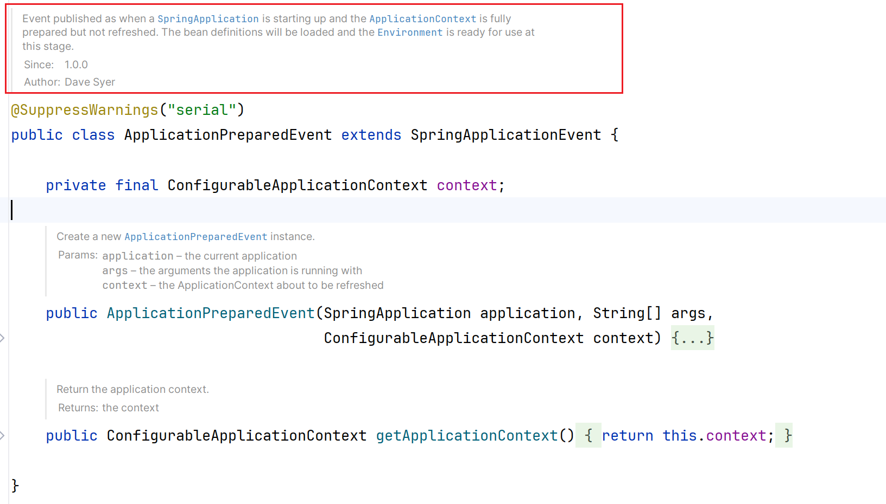

+++
draft = false
author = "CPoet"
title = "Spring启动时，将SpringContext设置到Util中（SpringContextUtil）"
date = "2024-07-01T18:31:50+08:00"
description = "在Spring应用开发中，为简化代码或者在静态方法中获取Spring应用的上下文，需要把SpringContext设置到类属性上。"
tags = []
categories = [
    "framework/spring",
]
+++
## 场景
在Spring应用开发中，为简化代码或者在静态方法中获取Spring应用的上下文，需要把SpringContext设置到类属性上。经过对源码的分析和实践，使用Spring的事件监听器监听`ApplicationPreparedEvent`事件是最佳的方式。

通过`ApplicationPreparedEvent`类的注释可知，该事件是在ApplicationContext创建完成后（未刷新前）发布的，也就是说我们收到该事件通知的时间比任何业务Bean初始化的时间都早。


## 实现
### 创建SpringContextUtil

```java
@UtilityClass
public class SpringContextUtil {

    private static Boolean isDev;
    private static ApplicationContext applicationContext;

    public static ApplicationContext getApplicationContext() {
        if (applicationContext == null) {
            throw new RuntimeException("应用上下文未初始化完成");
        }
        return applicationContext;
    }

    /**
     * 是否是开发模式
     *
     * @return 是否开发模式
     */
    public static boolean isDev() {
        if (isDev == null) {
            Environment environment = getApplicationContext().getEnvironment();
            String[] activeProfiles = environment.getActiveProfiles();
            for (String activeProfile : activeProfiles) {
                if (JudgerConst.PROFILE_DEV.equalsIgnoreCase(activeProfile.trim())) {
                    isDev = Boolean.TRUE;
                    break;
                }
            }
            if (isDev == null) {
                isDev = Boolean.FALSE;
            }
        }
        return isDev;
    }

    public static <T> T getBean(Class<T> clazz) {
        return getApplicationContext().getBean(clazz);
    }

    public static <T> T getBean(String name, Class<T> clazz) {
        return getApplicationContext().getBean(name, clazz);
    }

    public static <T> T getTryBean(Class<T> clazz) {
        try {
            return getBean(clazz);
        } catch (Exception ignored) {
        }
        return null;
    }

    public static void initApplicationContext(ApplicationContext applicationContext) {
        if (applicationContext != null) {
            SpringUtil.applicationContext = applicationContext;
        }
    }
}
```

### 创建AppContextInitListener

```java
@Slf4j
public class AppContextInitListener implements ApplicationListener<ApplicationPreparedEvent> {
    @Override
    public void onApplicationEvent(ApplicationPreparedEvent event) {
        log.info("Load app context");
        SpringUtil.initApplicationContext(event.getApplicationContext());
    }
}
```

### 注册监听器

```properties
# META-INF/spring.factories
org.springframework.context.ApplicationListener=\
  cn.cpoet.judger.support.AppContextInitListener
```
