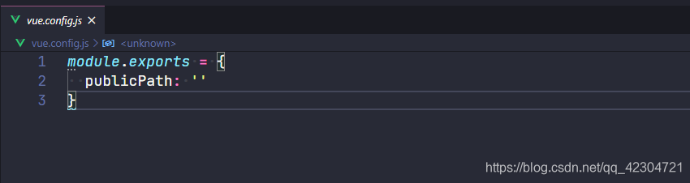
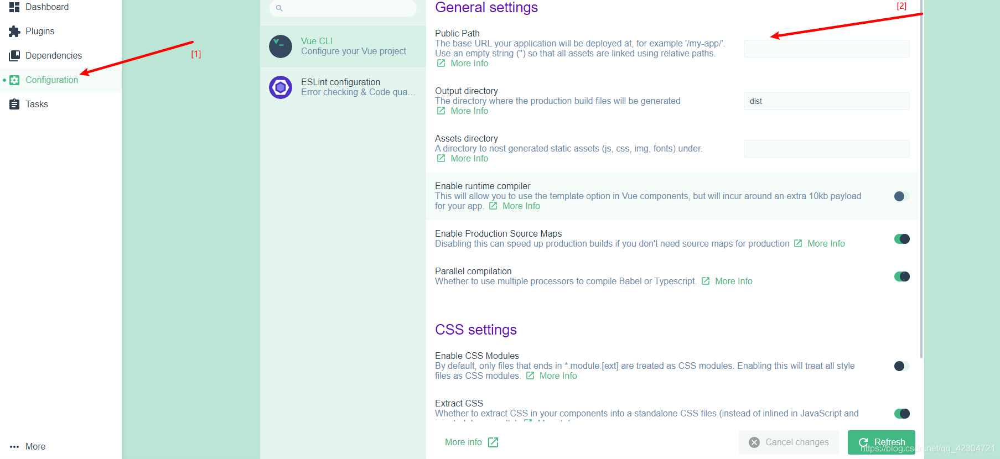

+++
draft = false
author = "CPoet"
title = "Vue配置使用相对路径访问静态资源（js、css、images）"
date = "2020-10-08T22:41:20+08:00"
description = ""
tags = ["Vue"]
categories = [
    "framework/vue",
]
image = "20201008000732349.png"
+++

在`vue项目`的配置文件`vue.config.js`的配置文件中添加`publicPath`配置

```javascript
module.exports = {
...
  publicPath: ''
...
}
```



**如果没有vue.config.js文件，可以手动创建。**

---

已安装`vue cli`脚手架的情况下，可以在`vue ui`中进行配置。

1. 启动`vue ui`

```shell
# 在终端执行
vue ui
```

2. 配置`publicPath`



把`Public Path`设置为空。
