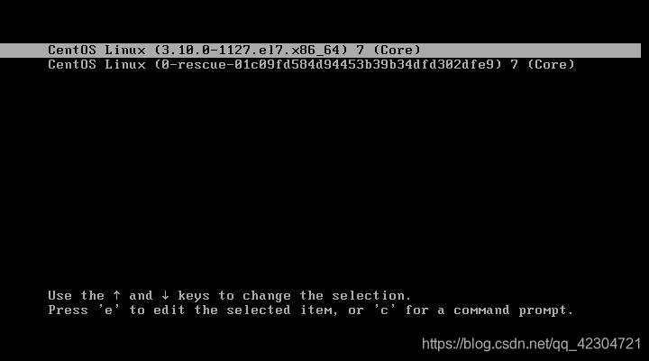
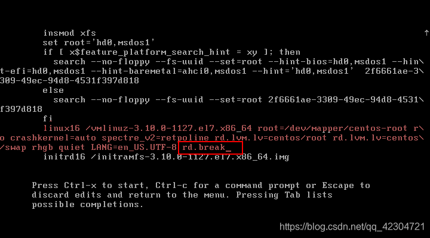

+++
draft = false
author = "CPoet"
title = "Linux忘记密码解决方案-紧急救援模式密码重置"
date = "2020-10-06T23:05:30+08:00"
description = ""
tags = ["Linux", "CentOS"]
categories = [
    "linux",
]
image = "20201006224245486.png"
+++

1. 在GRUD启动选择界面按下`e`键进入启动项编辑界面



2. 在`linux16`这一行的后面加上`rd.break`，在按下`Ctrl + x`(或 `F10`)的组合键以进入`Linux的紧急救援模式`



3. 在紧急救援模式下执行下列的命令完成密码重置

```shell
# 以读写的方式重新挂载sysroot
mount -o remount,rw /sysroot

# 切换至sysroot
chroot /sysroot

# 密码重置
# 格式： echo 密码|passwd 用户名 --stdin
echo 123456|passwd root --stdin

# 使配置生效
touch /.autorelabel

# 退出sysroot并重启
exit
reboot
```


**重启后即可使用新密码进行登录**
