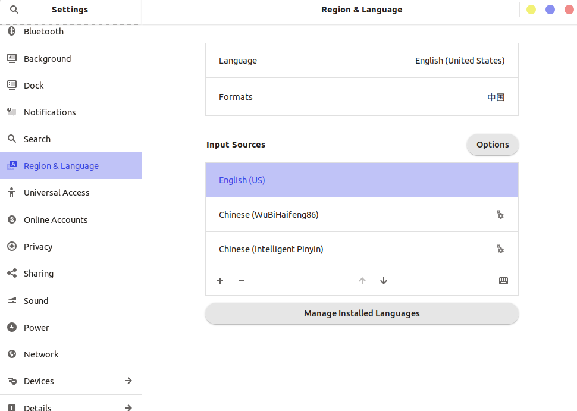

+++
draft = false
author = "CPoet"
title = "Ubuntu下chrome中五笔输入法不能通过shift切换中英文"
date = "2020-02-01T23:22:50+08:00"
description = ""
tags = ["Linux", "Ubuntu"]
categories = [
    "linux",
]
+++

> **背景：** 鉴于自己前后鼻音和平翘舌不分的缘故，我也是恨下心来使用五笔输入法，在使用的过程中还是有很多问题。其中一个就是在chrome中，五笔输入法不能通过shift（包括其他中英文切换按键）中英文。

**系统版本：** Ubuntu18.04 (linux 5.3.0-28-generic)

**chrome版本：** Version 79.0.3945.130 (Official Build) (64-bit)

**输入法：** IBus 1.5.17 海峰五笔86

经过测试发现拼音输入法一切正常，无论是IBUS框架还是小企鹅（fcitx）框架，只有五笔输入法在chrome不能正常使用。
目前替代方案就是添加英文输入法，然后通过win + space键切换输入法。

---

ubuntu系切换输入法快捷键：`win + space`

<b style="color:red;">&nbsp;&nbsp;2020年2月1日&nbsp;记</b>

