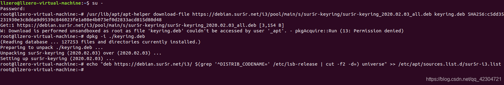
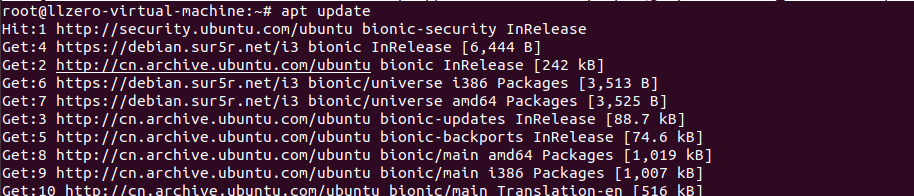
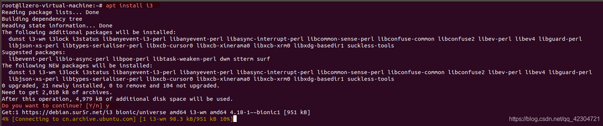
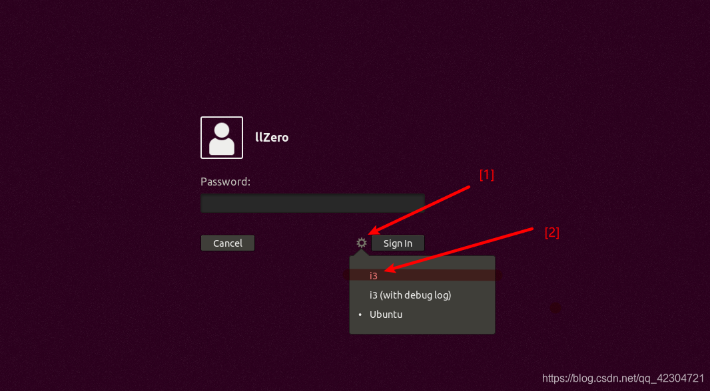
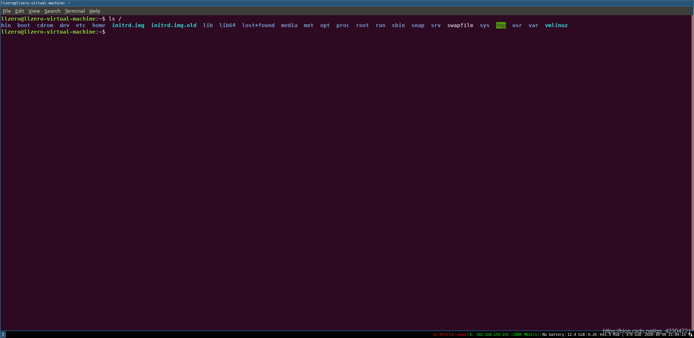

+++
draft = false
author = "CPoet"
title = "Ubuntu安装i3wm（i3窗口管理器）"
date = "2020-10-10T22:33:37+08:00"
description = ""
tags = ["Linux", "Ubuntu"]
categories = [
    "linux",
]
image = "20201010210117359.png"
+++

## 步骤

1. 添加最新稳定版的i3wm软件源信息




```shell
~$ su -

~# /usr/lib/apt/apt-helper download-file https://debian.sur5r.net/i3/pool/main/s/sur5r-keyring/sur5r-keyring_2020.02.03_all.deb keyring.deb SHA256:c5dd35231930e3c8d6a9d9539c846023fe1a08e4b073ef0d2833acd815d80d48

~# dpkg -i ./keyring.deb 

~# echo "deb https://debian.sur5r.net/i3/ $(grep '^DISTRIB_CODENAME=' /etc/lsb-release | cut -f2 -d=) universe" >> /etc/apt/sources.list.d/sur5r-i3.list
```

2. 更新ubuntu本地源信息



```shell
~#apt update
```


3. 安装i3wm



```shell
~#apt install i3
```

4. 进入i3wm
    1. 执行`reboot`重启系统
    2. 选择`i3wm`作为桌面系统




## 效果


