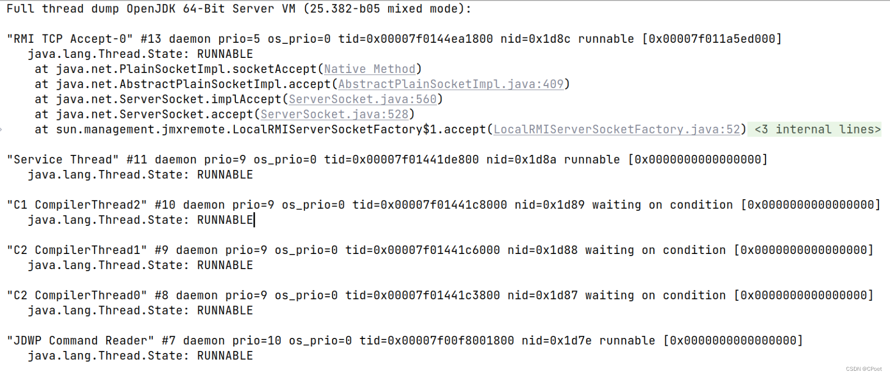
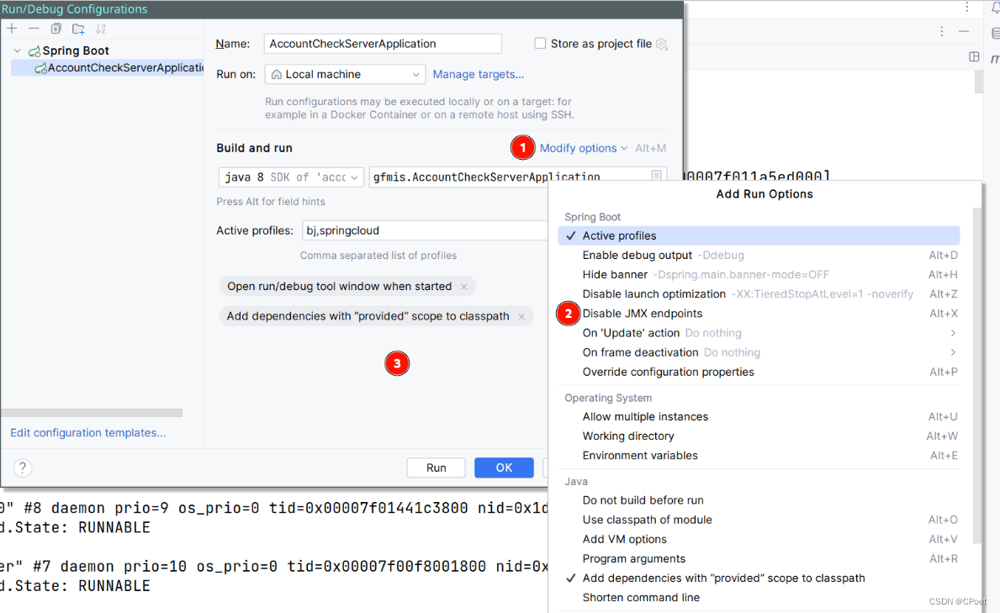
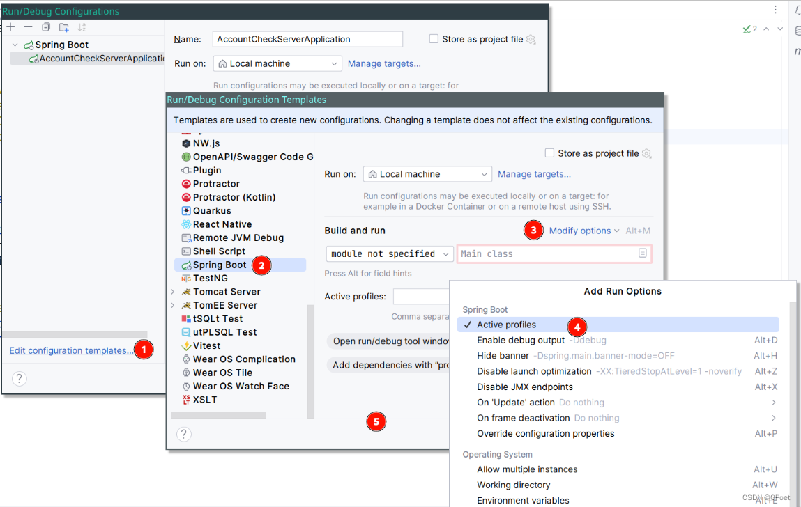

+++
draft = false
author = "CPoet"
title = "Linux Idea启动项目打印堆栈日志（JMX监控日志）"
date = "2024-04-13T15:19:13+08:00"
description = "关闭IDEA在Linux环境JMX监控日志"
tags = []
categories = [
    "mixeds",
]
image = "screenshot-log.png"
+++

## 说明

> Idea更新至新版本（2023.1）后， 在Linux环境下默认会开启JMX监控并输出日志。

## 关闭`JMX`监控

1. 打开`Configurations`配置面板。
2. 打开`Modify options(ALt + M)`选项面板。
3. 勾选`Disable JMX endpoints`。

## 修改Configurations模板

> 确定不需要打印JMX日志的情况下，可以通过修改Configuration模板一劳永逸。

1. 打开`Configurations`配置面板。
2. 点击`Edit Configutains Tempalte`打开编辑模板面板。
3. 左侧列表中找到`Spring Boot`模板。
4. 打开`Modify options(ALt + M)`选项面板。
5. 勾选`Disable JMX endpoints`。

