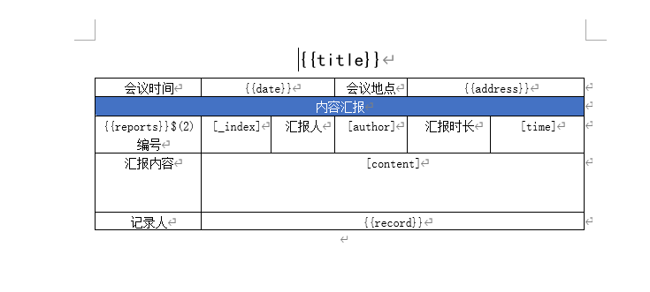

+++
draft = false
author = "CPoet"
title = "poi-tl-ext扩展，实现多行表格模板替换"
date = "2021-06-26T21:06:42+08:00"
description = "目前poi-tl只提供了word表格的单行模板渲染能力，但是在实际的开发中，业务需求涉及多行，这里就需要自己编写一个渲染策略。"
tags = []
categories = [
    "mixeds",
]
+++

## 前言
目前poi-tl只提供了word表格的单行模板渲染能力，但是在实际的开发中，业务需求涉及多行，这里就需要自己编写一个渲染策略。

## 正文
因为poi-tl使用指定策略的方式为通过ConfigureBuilder的bind方式指定处理某个参数的变量，比如这样：

```java
ConfigureBuilder builder = Configure.builder();
builder.bind("reports", new MultipleRowTableRenderPolicy());
```

所以第一步需要获取reports所在的行位置。

```java
protected int getRowIndex(XWPFTableRow row) {
    List<XWPFTableRow> rows = row.getTable().getRows();
    return rows.indexOf(row);
}
```

由于是多行渲染，因此需要知道定义的模板行数。

```java
    protected int getMultipleRowNum(XWPFTemplate template) throws CloneNotSupportedException {
        TemplateResolver resolver = new TemplateResolver(template.getConfig().copy(multiplePrefix, multipleSuffix));
        List<MetaTemplate> metaTemplates = resolver.resolveDocument(template.getXWPFDocument());
        if (!metaTemplates.isEmpty()) {
            RunTemplate run = cast2runTemplate(metaTemplates.get(0));
            String tagName = run.getTagName();
            int num = Integer.parseInt(tagName);
            run.getRun().setText("", 0);
            return num < 1 ? DEFAULT_MULTIPLE_ROW_NUM : num;
        }
        return DEFAULT_MULTIPLE_ROW_NUM;
}
```

拿到基本信息后就可以遍历数据，进而遍历渲染表格了。

```java
run.setText("", 0);
TemplateResolver resolver = new TemplateResolver(template.getConfig().copy(prefix, suffix));
// 获取模板所在的起始行
int position = getRowIndex(tagCell.getTableRow());
List<XWPFTableRow> tempRows = getAllTemplateRow(table, template, position);
// 保存第行模板，以便在后续操作中获取光标
final XWPFTableRow firstTempRow = tempRows.get(0);
Iterator<?> dataIt = ((Iterable<?>) data).iterator();
boolean hasNextData = dataIt.hasNext();
int index = 0;

while (hasNextData) {
    Object dt = dataIt.next();
    hasNextData = dataIt.hasNext();

    Iterator<XWPFTableRow> rowTempIt = tempRows.iterator();
    boolean hasNextTempRow = rowTempIt.hasNext();
    while (hasNextTempRow) {
        XWPFTableRow tempRow = rowTempIt.next();
        hasNextTempRow = rowTempIt.hasNext();

        if (!table.addRow(tempRow, position)) {
            throw new RenderException("创建新的表格行失败");
        }

        // 光标操作，移动光标到目标行，以便后续的模板渲染
        XmlCursor newCursor = firstTempRow.getCtRow().newCursor();
        newCursor.toPrevSibling();
        XmlObject object = newCursor.getObject();
        XWPFTableRow newRow = new XWPFTableRow((CTRow) object, table);
        newRow.getCtRow().set(object);
        setTableRow(table, newRow, position);

        List<XWPFTableCell> cells = newRow.getTableCells();
        RenderDataCompute dataCompute = template.getConfig().getRenderDataComputeFactory()
            .newCompute(EnvModel.of(dt, EnvIterator.makeEnv(index++, hasNextData || hasNextTempRow)));
        cells.forEach(tableCell -> {
            List<MetaTemplate> metaTemplates = resolver.resolveBodyElements(tableCell.getBodyElements());
            new DocumentProcessor(template, resolver, dataCompute).process(metaTemplates);
        });
        ++position;
    }
}

removeTableRow(table, position, tempRows.size());
```

**值得一提就是光标的移动操作，相当于操作所有行的确定。取模板的第一行作为基位置，然后每次插入的渲染的行后，就把光标向上移一行，进而指向刚插入的行，最后渲染即可。**

`EnvIterator.makeEnv`只是为了生成一些遍历现在时参数，可以用在渲染参数的表达式中，具体可以参数poi-tl的文档。

附上removeTableRow函数的实现，注意：使用下标移出行时，下标千万不要作自增操作。

```java
protected void removeTableRow(XWPFTable table, int startIndex, int size) {
        for (int i = 0; i < size; ++i) {
            table.removeRow(startIndex);
        }
}
```

## 测试

### 模板



### 代码

```java
public class MultipleRowTableRenderPolicyTest {
	public static void main(String[] args) throws IOException {
		Map<String, Object> params = new HashMap<>();
		params.put("title", "某某某会议");
		params.put("date", new Date());
		params.put("address", "某某会议室");

		List<Report> reports = new ArrayList<>();
		reports.add(new Report("王五", new Date(), "汇报内容1"));
		reports.add(new Report("张三", new Date(), "汇报内容2"));
		reports.add(new Report("李四", new Date(), "汇报内容3"));
		params.put("reports", reports);

		ConfigureBuilder builder = Configure.builder();
		builder.bind("reports", new MultipleRowTableRenderPolicy());
		XWPFTemplate xt = XWPFTemplate
			.compile("src/test/resources/template/render-multiple-row.docx", builder.build())
			.render(params);
		xt.writeToFile("render-multiple-row.docx");
	}

	static class Report {
		private String author;

		private Date time;

		private String content;

		public Report(String author, Date time, String content) {
			this.author = author;
			this.time = time;
			this.content = content;
		}

		public String getAuthor() {
			return author;
		}

		public void setAuthor(String author) {
			this.author = author;
		}

		public Date getTime() {
			return time;
		}

		public void setTime(Date time) {
			this.time = time;
		}

		public String getContent() {
			return content;
		}

		public void setContent(String content) {
			this.content = content;
		}
	}
}
```

## 结语
相关代码已经上传至github，地址：[GitHub - c-poet/poi-tl-ext: poi-tl扩展](https://github.com/c-poet/poi-tl-ext)
