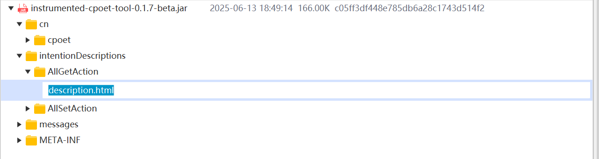

+++
draft = false
author = "CPoet"
title = "PatchAssistant2J 1.3.x 说明文档"
date = "2025-08-26T20:43:30+08:00"
description = ""
tags = ["补丁", "文档", "助手"]
categories = [
    "projects/patch-assistant-to-java",
]
+++

## 主界面

### 分区导航
- [区域1 选项栏](#选项栏)
- [区域2 应用树](#应用树)
- [区域3 补丁树](#补丁树)
- [区域4 补丁信息](#补丁信息-1)
- [区域5 状态栏](#状态栏)

## 选项栏
左侧提供**补丁信息**、**选中联动**、**文件详情**等常用选项的快捷操作，右侧提供**搜索**、**配置**、**关于**等功能的打开按钮。

### 补丁信息
控制主界面下方的**补丁信息窗体**的显示。

- 勾选：显示补丁信息窗体
- 未勾选：隐藏补丁信息窗体。

### 选中联动
在应用文件和补丁文件已经匹配（新增、修改）的情况，控制选中应用文件或者补丁文件时，已经关联的匹配文件自动选中。

- 勾选：自动选中已经关联匹配的文件
- 未勾选：禁用自动选中已经关联匹配的文件

### 文件详情
控制应用树和补丁树是否显示文件的详情信息（修改时间、文件大小、文件Hash值等）。

- 勾选：在应用树和补丁树中显示文件详情
- 未勾选：在应用树和补丁树中不显示文件详情

### 仅看变动
在应用文件和补丁文件已经匹配（新增、修改）的情况，应用树仅显示已经关联匹配的文件。在没有文件匹配的情况下，应用树显示无叶子节点的空树。

- 勾选：应用树仅显示已经关联匹配的文件
- 未勾选：应用树显示所有的文件

### Docker镜像
控制是否应用Docker镜像模式，应用Docker镜像模式的情况下，程序自动将生成的应用包上传到Docker服务器，按照Dockerfile模板生成Docker镜像、导出Docker镜像，并自动把导出的`.tar`文件下载至指定目录（生成速度受Docker配置、计算机状态、网络等因素的影响）。

- 勾选：保存Docker镜像（*.tar）
- 未勾选：保存应用包（*.jar）

## 应用树
按层级展示应用包中的内容，支持多层展开，即Jar包无限嵌套的情况。

### 选择应用包
点击“选择”按钮或者通过快捷键`Ctrl + O`可以打开资源管理器选择应用包，仅支持`*.jar`格式的Java应用包。也可以通过拖拽的方式将`*.jar`包拖入应用树区域。

### 右键菜单
当焦点在应用树时，通过单击鼠标右键打开操作菜单。

#### 创建目录
选中目录时显示“创建目录”菜单项，可以在当前选中的目录下面创建子目录，创建时可以直接对新增的目录名称进行编辑，按回车键确认。

#### 重新加载
选中根节点时显示“重新加载”菜单项，该操作可以重新读取应用文件并刷新应用树。当焦点在应用树时，也可以通过`F5`快捷键或者`Ctrl + R`快捷键重新加载应用树。

#### 重命名
选中目录或者文件时显示“重命名”菜单项，该操作可以直接修改文件名称。当选中目录或者文件时，可以通过`F2`快捷键进行重命名。

#### 删除
选中未关联的文件或者目录时显示“删除”菜单项，该操作会直接将文件或者目录从应用树中移出。

#### 标记删除
选中未关联的文件或者目录时显示“标记删除”菜单项，该操作不会立即删除文件，而是将文件类型标记为删除状态，并且显示颜色置灰，在保存应用时才会排除该文件。对于通过补丁说明匹配删除的文件状态为标记删除状态。

#### 保存文件
选中文件时显示“保存文件”菜单项，该操作可以将选中的文件保存到指定的位置，或者通过**拖拽**的将文件拖到指定位置。

#### 保存源文件
选中`*.class`文件时显示“保存源文件”菜单项，该操作将直接反编译字节码文件并将反编译的结果保存到指定位置。

#### 资源管理器中查看
当选中的目录或者文件在磁盘中存在时显示“资源管理器中查看”菜单项，该操作将直接打开资源管理器并定位到选中的文件。应用树只有根节点在磁盘中有文件对应，其余节点均为压缩包中的文件，因此只有根节点会显示该菜单项。

#### 聚焦应用
“聚焦应用”菜单项会把补丁树区域隐藏，仅显示应用树区域。

## 补丁树
按层级展示补丁包或者补丁目录中的内容，支持无限嵌套补丁包（目前支持`*.zip`和`*.rar`两种压缩格式）。

### 选择补丁包
点击“选择”按钮或者通过快捷键`Ctrl + O`可以打开资源管理器选择补丁包，仅支持`*.zip`和`*.rar`格式的补丁包。也可以通过拖拽的方式将`*.zip`或者`*.rar`包拖入补丁树区域。

### 选择补丁目录
点击“目录”可以打开资源管理器选择补丁目录，也可以通过拖拽的方式将补丁文件所在目录拖入补丁树区域。

### 右键菜单
当焦点在补丁树时，通过单击鼠标右键打开操作菜单。

#### 重新加载
选中根节点时显示“重新加载”菜单项，可以重新读取补丁文件、补丁目录内容刷新补丁树。当焦点在补丁树时，也可以通过`F5`快捷键或者`Ctrl + R`快捷键重新加载补丁树。

当选中**标记根节点**时显示“刷新信息”菜单项，支持重新读取标记根节点的补丁说明文件，刷新当前标记根节点的绑定信息。也可以通过`F5`快捷键或者`Ctrl + R`快捷键完成刷新。

> 注意：“重新加载”和“刷新信息”会根据当前节点所在根的类型（根、标记根）显示其中一个菜单项，快捷键亦然。

#### 保存文件
参考：[应用树-保存文件](#保存文件)

#### 保存源文件
参考：[应用树-保存源文件](#保存源文件)

#### 查看签名
查看签名可以查看**根节点**和**标记根节点**的详细文件信息，包括补丁编码、补丁名称、完整Hash值等信息，可用于校验补丁文件完整性。

#### 查看绑定信息

#### 资源管理器中查看

#### 聚焦补丁
“聚焦补丁”菜单项会把应用树区域隐藏，仅显示补丁树区划。

## 补丁信息

### 补丁说明文件（README.txt）

## 状态栏
状态栏左边显示操作统计信息，右侧显示**保存**按钮。

### 统计信息
- 新增-显示应用树新增的文件数量
- 修改-显示应用树更新的文件数量
- 删除-显示应用树手动删除的文件数量
- 标记删除-显示应用树根据说明文件匹配删除的文件数量和手动标记删除的文件数量之和

### 保存按钮
替换完补丁后需要点击右下角的**保存**按钮保存操作结果，未保存操作结果不会同步到应用文件。

保存没有进行任何操作的应用包时，将会提示：

如果应用包已经替换过相同的补丁包时，将会提示：

> 注意：补丁包执行重复提示需要开启“写入补丁签名”功能，参考 [补丁配置](#补丁配置)

## 文件查看

### 普通文本

### 代码高亮

### 反编译

### 文本字符集
内容查看时，通过右键菜单要的字符编码，支持`GBK`和`UTF-8`字符集，满足绝大部分的情况。

### 差异（对比）模式
差异（对比）模式的前提是应用文件和补丁文件已经匹配，可以通过右键菜单切换模式。

对比模式：呈左右两侧内容，左边是应用树文件内容，右边是补丁树文件内容

差异模式：应用树文件内容和补丁树文件内容通过文本对比工具对比后合并显示

> @@ -1,2 +1,1 @@
>
> 代表：从第一行开始删除两行内容，从第1行开始新增一行内容

### 其他文件
对于非文本文件或者程序未支持的文件类型，会调用系统默认程序打开。

## 搜索

### 快速搜索

### 高级搜索（弹窗）

## 配置（界面）

### 常规配置
| 配置项 | 默认值 | 配置说明 | 生效时间 |
| :---: | :---: | --- | :---: |
| 主题 | 明亮主题 | **明亮主题**、**暗夜主题** | 保存 |
| 语言 | English |  简体中文、英文 | 重启 |

### 搜索配置
| 配置项 | 默认值 | 配置说明 | 生效时间 |
| :---: | :---: | --- | :---: |
| 保存历史条数 | 30 | 高级搜索保存搜索记录的条数 | 保存 |

### 补丁配置
| 配置项 | 默认值 | 配置说明 | 生效时间 |
| :---: | :---: | --- | :---: |
| 用户名 | 计算机登录用户名 | 写入补丁签名时优先使用该值 | 保存 |
| 开启路径匹配 | 是 | 自动按全路径匹配补丁文件 | 保存 |
| 开启文件名匹配 | 是 | 自动按文件名匹配补丁文件 | 保存 |
| 说明文件 | README.txt | 补丁说明文件名称 | 保存 |
| 写入补丁签名 | 是 | 保存应用包时将补丁签名写入`META-INF/patch-up.sign`文件 | 保存 |
| UnRar路径 | C:\Program Files\WinRAR | Unrar程序的路径，用于解压rar5压缩包 | 保存 |

### Docker配置
| 配置项 | 默认值 | 配置说明 | 生效时间 |
| :---: | :---: | --- | :---: |
| 本机 | 是 | 调用本地docker命令生成tar镜像包 | 保存 |
| 远程 | 否 | 调用远程docker命令生成tar镜像包，需要配置远程信息 | 保存 |
| 命令 | docker | docker命令（可填写全路径） | 保存 |
| 目录 | /opt/PatchAssistant2J | 上传、导出文件的工作目录 | 保存 |
| 地址 | - | 远程docker服务器的地址和端口 | 保存 |
| 用户 | - | 远程docker服务器登录的用户名 | 保存 |
| 密码 | - | 远程docker服务器登录的密码 | 保存 |

## 快捷键
| 位置 | 快捷键 | 说明 |
| :---: | :---: | --- |
| 应用树 | F5/Ctrl + R | 重新加载应用包 |
| 应用树 | Ctrl + O | 选择应用包 |
| 应用树 | F2 | 重命名文件 |

## 特别鸣谢

## 开发计划

[PatchAssistant2J 开发计划](/post/projects/patch-assistant-to-java/plan)
