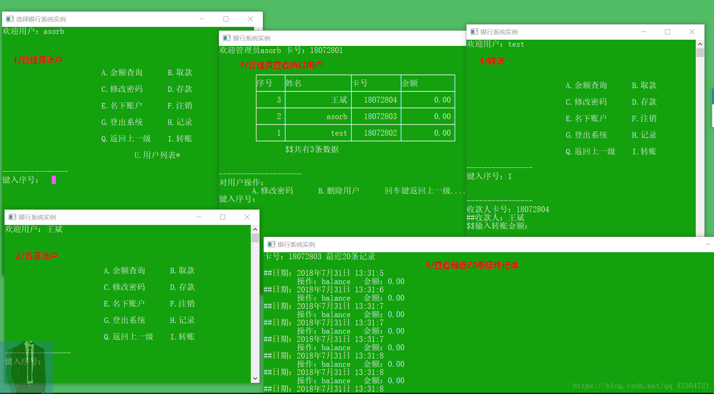


在上小学期的时间里，用C语言简单的写了一个银行的管理系统实例，整体上还是显得有些粗糙。但是对于初学者来说，可以作为一些参考。程序的编写环境是VS2013，为了能让学校运行，所以在DEVC++中进行了测试。由于在编写的时候在循环体中加入了局部变量，所以在VC++中是不能被编译的，如果有需要的同学可以自行修改。


## 应用代码

1/全局头文件(banksystem.h)

```c
/*
**banksystem文件头
**ASorb time:201807
*/
#include<stdio.h>
#include<stdlib.h>
#include<string.h>
#include<time.h>
//基本常量
#define user_max 99		//用户最大数
#define take_notes_max 20	//记录数
#define data_file "bankdata.orb"		//数据文件默认地址
#define user_size sizeof(user)
//结构体变量
struct take_notes{
	char handle[10];	//操作
	float money;		//操作的钱数
	struct tm T;		//时间结构体
};

typedef struct{
	char name[25];		//用户名
	unsigned int card;		//银行卡号
	char pass[8];		//密码
	float balance;		//余额
	struct take_notes list[take_notes_max];
}user;
//宏
```


2/入口文件（main.cpp）

```c
/*
**功能实现：银行系统实例
**开发环境：VS2013
**ASorb time:201807
**默认管理名：asorb 号：18072801 密码：123456
**测试环境：DEVC++5.10 （修改：1/结构体不能直接赋值，分成员赋值） 
*/ 
//主函数
#include"banksystem.h"
int main(){
	void file_true();
	void face();
	char face_1();
	void face_2();
	void add_user();
	user* login();
	face();			//初始化窗口 
	file_true();
	char h1;
	while ((h1 = face_1()) != 'Q') {
		if (h1 == 'A'){
			if (login()->name[0] != NULL){
				system("cls");
				face_2();
			}
		}
		else if (h1 == 'B')
			add_user();
	}
	return 0;
}
```

3/功能函数文件（function.cpp）

```c
/*
**功能函数
**ASorb time:201807
*/
#include"banksystem.h"
//添加新用户
void add_user(){
	int user_num();
	void file_read(user*);
	void file_save(user*, int);
	user p = { NULL };
	char y = NULL;
	printf("\n\n注册用户\n");
	printf("--------------\n你的姓名（20字符内）：");
	fflush(stdin);
	gets(p.name);
	printf("你的密码（6个字符）：");
	fflush(stdin);
	gets(p.pass);
	if (strlen(p.name) == 0 || strlen(p.name) > 20){
		printf("ERROR224：姓名格式错误！\n");
		y = 'N';
	}
	if (strlen(p.pass) != 6){
		printf("ERROR224：密码格式错误！\n");
		y = 'N';
	}
	if (y == NULL){
		user list[user_max] = { NULL };
		file_read(list);
		for (int i = user_num() - 1; i >= 0; i--)
		if (strcmp(list[i].name, p.name) == 0){
			printf("------------------\n");
			printf("提示：系统检测到存在相同的用户名，继续注册将添加新的卡号！\n");
			printf("\tY.继续\t回车键放弃\n");
			printf("键入选择：");
			fflush(stdin);
			y = getchar();
		}
		if (y == 'Y' || y == NULL){
			(p.card) = ((list + (user_num() - 1))->card + 1);		//新银行卡号
			p.balance = 0;
			list[user_num()] = p;		//加入用户
			file_save(list, user_num() + 1);
			system("cls");
			printf("提示：注册成功！\n\t用户名：%s\t卡号:%d", p.name, p.card);
		}
		else{
			system("cls");
			printf("提示：用户放弃注册！");
		}
	}
	else{
		printf("\n提示：注册失败！回车键返回...\n");
		fflush(stdin);
		getchar();
		system("cls");
	}
} 
//用户登录
user* login(){
	static user p = { NULL };
	int user_num();
	void file_read(user*);
	user list[user_max] = { NULL };
	file_read(list);
	if (p.name[0] == NULL){
		printf("--------------------\n");
		printf("输入卡号：");
		fflush(stdin);
		scanf("%d", &p.card);
		printf("输入密码：");
		fflush(stdin);
		gets(p.pass);
		for (int i = user_num() - 1; i >= 0; i--){
			if (list[i].card == p.card){
				if (strcmp(list[i].pass, p.pass) == 0)
					p = list[i];
				else{
					p.name[0] = NULL;
					printf("提示：密码错误！回车键返回.....\n");
					fflush(stdin);
					getchar();
					system("cls");
				}
				break;
			}
			else if (i == 0){
				p.name[0] = NULL;
				printf("提示：卡号不存在！回车键返回......\n");
				fflush(stdin);
				getchar();
				system("cls");
			}
		}
	}
	else{
		for (int i = user_num(); i >= 0; i--)
		if (list[i].card == p.card){
			p = list[i];
			break;
		}
	}
	return &p;
}
//余额查询
void balance_num(){
	user* login();
	user *p = login();
	void handle_save(struct tm*,float,char arr[]);
	struct tm* time_now();
	static int num_1 = 1;
	struct tm *t = time_now();
	printf("余额查询-银行系统实例\n\n\n\n");
	printf("\t┌────────────────┬────────────────┬──────────────────┐\n");
	printf("\t│姓名：%-10s│卡号：%-10d│余额：%10.2f元│\n", p->name, p->card, p->balance);
	printf("\t└────────────────┴────────────────┴──────────────────┘\n");
	handle_save(t, 0,"balance");		//保存记录
	printf("\n\t$$当前时间：%d-%d-%d %d:%d:%d 已记录", 1900+t->tm_year, 1+t->tm_mon,t->tm_mday,8+t->tm_hour,t->tm_min,t->tm_sec);
	printf("\n\nY.刷新\t回车键返回.....\n");
	printf("----------------\n键入选择：");
	fflush(stdin);
	if (getchar() == 'Y'){
		system("cls");
		printf("第 %d 次刷新成功！\t",num_1++);
		balance_num();
	}
	else
		system("cls");
}
//取款
void draw(){
	void file_read(user*);
	void file_save(user*,int);
	void handle_save(struct tm*, float, char arr[]);
	struct tm* time_now();
	struct tm *t = time_now();
	int user_num();
	int num_2 = 0;
	float money;
	user* login();
	user *p = login();
	user list[user_max] = { NULL };
	printf("\n--------------\n金额：");
	scanf("%f", &money);
	if (money <= 0){
		system("cls");
		printf("提示：取款失败，原因金额应大于零！\t");
	}
	else if (money > (p->balance)) {
		system("cls");
		printf("提示：取款失败，原因余额不足！\t");
	}
	else {
		file_read(list);
		for (num_2; list[num_2].card != p->card; num_2++);
		(p->balance) -= money;
		list[num_2].balance = p->balance;
		handle_save(t, money, "draw");
		file_save(list, user_num());
		system("cls");
		printf("提示：取款成功! 金额：%.2f元\t", money);
	}
}
//存款
void deposit(){
	void file_read(user*);
	void file_save(user*, int);
	void handle_save(struct tm*, float, char arr[]);
	struct tm* time_now();
	struct tm *t = time_now();
	int user_num();
	int num_3 = 0;
	float money;
	user* login();
	user *p = login();
	user list[user_max] = { NULL };
	printf("\n--------------\n金额：");
	scanf("%f", &money);
	if (money <= 0){
		system("cls");
		printf("提示：存款失败，原因金额应大于零！\t");
	}
	else {
		file_read(list);
		for (num_3; list[num_3].card != p->card; num_3++);
		(p->balance) += money;
		list[num_3].balance = p->balance;
		handle_save(t, money, "deposit");
		file_save(list, user_num());
		system("cls");
		printf("提示：存款成功! 金额：%.2f元\t", money);
	}
}
//修改密码
void editpass(){
	void file_read(user*);
	void file_save(user*, int);
	user* login();
	int user_num();
	void handle_save(struct tm*, float, char arr[]);
	struct tm* time_now();
	struct tm *t = time_now();
	user *p = login();
	user list[user_max] = { NULL };
	char pass[8];
	int num_6 = 0;
	printf("\n\n----------------------\n");
	printf("*认证/输入原密码：");
	fflush(stdin);
	gets(pass);
	if (strcmp(p->pass, pass) == 0){
		printf("输入新密码（6个字符）：");
		fflush(stdin);
		gets(pass);
		if (strlen(pass) == 6){
			file_read(list);
			for (num_6; list[num_6].card != p->card; num_6++);
			strcpy(list[num_6].pass, pass);
			handle_save(t, 0, "editpass");
			file_save(list, user_num());
			system("cls");
			printf("提示：新密码设置成功，以后请使用新密码登录！\t");
		}
		else{
			system("cls");
			printf("提示：修改失败，原因新密码不符合规定！\t");
		}
	}
	else{
		system("cls");
		printf("提示：修改失败，原因认证失败！\t");
	}
}
//名下账户
void account(){
	user* login();
	user *p = login();
	void file_read(user*);
	user list[user_max] = { NULL };
	int user_num();
	int num_8 = 0;
	file_read(list);
	system("cls");
	printf("用户：%s 名下账户\n\n\n", p->name);
	printf("\t\t┌─────┬─────────────────┬─────────────┐\n");
	printf("\t\t│序 号│   姓 名         │卡 号        │\n");
	for (int i = user_num() - 1; i >= 0; i--, num_8++)
	if (strcmp(list[i].name, p->name) == 0){
		printf("\t\t├─────┼─────────────────┼─────────────┤\n");
		printf("\t\t│%5d│%17s│%13d│\n", i, list[i].name, list[i].card);
	}
	printf("\t\t└─────┴─────────────────┴─────────────┘\n");
	printf("\t\t$$共%d条数据\n", num_8);
	printf("\n\n回车键返回......\n");
	fflush(stdin);
	getchar();
	system("cls");
}
//注销
char del_user(){
	user* login();
	user *p = login();
	int user_num();
	void file_read(user*);
	void file_save(user*, int);
	user list[user_max] = { NULL };
	char pass[8];
	int num_7 = 0;
	if (p->card != 18072801) {
		printf("\n\n--------------\n认证/输入密码：");
		fflush(stdin);
		gets(pass);
		if (strcmp(p->pass, pass) == 0){
			file_read(list);
			for (num_7; list[num_7].card != p->card; num_7++);
			for (num_7; num_7 < user_num() - 1; num_7++)
				list[num_7] = list[num_7 + 1];
			file_save(list, user_num() - 1);
			p->name[0] = NULL;
			printf("\n卡号：%d 注销成功，回车键返回......\n", p->card);
			fflush(stdin);
			getchar();
			return 'Q';
		}
		else{
			system("cls");
			printf("提示：注销失败，原因认证失败！\t");
			return NULL;
		}
	}
	else{
		system("cls");
		printf("提示：默认管理员账户不能注销！\t");
		return NULL;
	}
}
//登出系统
char out_login(){
	user* login();
	user *p = login();
	printf("\n\n------------------\n");
	printf("\tQ.返回\t回车键登出系统.......\n");
	fflush(stdin);
	if (getchar() == 'Q'){
		system("cls");
		return NULL;
	}
	else{
		p->name[0] = NULL;
		return 'Q';
	}
}
//记录查询
void handle_list(){
	user* login();
	user *p = login();
	char h1;
	struct tm t[2];
	printf("\n\n---------------------\n\tA.近%d条记录\tB.按时间段查询\n", take_notes_max);
	printf("键入序号：");
	fflush(stdin);
	h1 = getchar();
	int num_9 = 0;
	if (h1 == 'A'){
		system("cls");
		printf("卡号：%d 最近%d条记录\n\n", p->card, take_notes_max);
		for (int i = 0; (i < take_notes_max)&&(p->list[i].handle[0] != NULL); i++)
			printf("##日期：%d年%d月%d日 %d:%d:%d\n\t操作：%s\t金额：%.2f\n", 1900 + p->list[i].T.tm_year, 1 + p->list[i].T.tm_mon, p->list[i].T.tm_mday, 8 + p->list[i].T.tm_hour, p->list[i].T.tm_min, p->list[i].T.tm_sec, p->list[i].handle, p->list[i].money);
		printf("\n\n\n回车键返回........\n");
		fflush(stdin);
		getchar();
		system("cls");
	}
	else if (h1 == 'B'){
		printf("\n\n------------------------\n输入开始日期（格式：2018-07-29）：");
		scanf("%d-%d-%d", &t[0].tm_year, &t[0].tm_mon, &t[0].tm_mday);
		printf("输入结束日期：");
		scanf("%d-%d-%d", &t[1].tm_year, &t[1].tm_mon, &t[1].tm_mday);
		system("cls");
		printf("日期：%d年%d月%d日-%d年%d月%d日 的记录\n\n", t[0].tm_year,t[0].tm_mon, t[0].tm_mday, t[1].tm_year, t[1].tm_mon, t[1].tm_mday);
		for (int i = 0;( i < take_notes_max)&&(p->list[i].handle[0] != NULL); i++)
		if (p->list[i].T.tm_year >= (t[0].tm_year - 1900) && p->list[i].T.tm_mon >= (t[0].tm_mon - 1) && p->list[i].T.tm_mday >= t[0].tm_mday)
		if (p->list[i].T.tm_year <= (t[1].tm_year - 1900) && p->list[i].T.tm_mon <= (t[1].tm_mon - 1) && p->list[i].T.tm_mday <= t[1].tm_mday) {
			printf("##日期：%d年%d月%d日 %d:%d:%d\n\t操作：%s\t金额：%.2f\n", 1900 + p->list[i].T.tm_year, 1 + p->list[i].T.tm_mon, p->list[i].T.tm_mday, 8 + p->list[i].T.tm_hour, p->list[i].T.tm_min, p->list[i].T.tm_sec,p->list[i].handle,p->list[i].money);
			num_9++;
		}
		printf("\n\n$$共%d条记录\n", num_9);
		printf("\n\n回车键返回.......\n");
		fflush(stdin);
		getchar();
		system("cls");
	}
	else{
		system("cls");
		printf("提示：选择错误，重新选择！\t");
	}
}
//转账
void cover(){
	user* login();
	void file_read(user*);
	void file_save(user*, int);
	int user_num();
	user *p = login();
	user list[user_max] = { NULL };
	int card;
	float money, F;
	printf("\n\n----------------\n收款人卡号：");
	scanf("%d", &card);
	file_read(list);
	for (int i = user_num() - 1; i >= 0; i--)
		if (list[i].card == card){
			int ii = strlen(list[i].name);
			printf("##收款人：%s\n", list[i].name);
			printf("$$输入转账金额：");
			scanf("%f", &money);
			if (money >= 0 && money <= p->balance){
				printf("\tY.确认转账\t回车键取消.........\n");
				printf("键入选择：");
				fflush(stdin);
				if (getchar() == 'Y'){
					for (ii = user_num() - 1; ii >= 0 && (list[ii].card != p->card); ii--);
					list[i].balance += money;
					p->balance -= money;
					list[ii].balance = p->balance;
					file_save(list, user_num());
					system("cls");
					printf("提示：转账成功！ 收款人：%d 金额：%.2f\t", card, money);
				}
				else{
					system("cls");
					printf("提示:取消转账！\t");
				}
			}
			else{
				system("cls");
				printf("提示：余额不足，转账失败！\t");
			}
			card = 0;
			break;
		}
	if (card != 0){
		system("cls");
		printf("提示：转账失败，原因不存在的收款人！\t");
		}
}
//用户列表，管理员
void user_list(){
	user* login();
	user *p = login();
	void file_read(user*);
	void file_save(user*, int);
	int user_num();
	int user_u;
	char h1;
	user list[user_max] = { NULL };
	if (p->card == 18072801){
		printf("欢迎管理员%s\t卡号：%d\n", p->name, p->card);
		file_read(list);
		printf("\n\n");
		printf("\t┌──────┬───────────────┬───────────┬────────────┐\n");
		printf("\t│序号  │姓名           │卡号       │余额        │\n");
		for (int i = user_num() - 1; i >= 0; i--)
		if (list[i].card != 18072801){
			printf("\t├──────┼───────────────┼───────────┼────────────┤\n");
			printf("\t│%6d│%15s│%11d│%12.2f│\n", i, list[i].name, list[i].card, list[i].balance);
		}
		printf("\t└──────┴───────────────┴───────────┴────────────┘\n");
		printf("\t\t$$共有%d条数据\n", user_num() - 1);
		printf("\n\n--------------------\n对用户操作：\n\tA.修改密码\tB.删除用户\t回车键返回上一级.......\n");
		printf("键入序号：");
		fflush(stdin);
		h1 = getchar();
		if (h1 == 'A' || h1 == 'B') {
			printf("操作用户的序号：");
			scanf("%d", &user_u);
			if (user_u >= 0 && user_u <= (user_num() - 1)) {
				if (h1 == 'A'){
					printf("输入新密码：");
					fflush(stdin);
					gets(list[user_u].pass);
					file_save(list, user_num());
					system("cls");
					printf("卡号：%d 密码修改成功！\t",list[user_u].card);
					user_list();
				}
				else{
					printf("Y.确定删除\t回车键返回.......\n");
					fflush(stdin);
					if (getchar() == 'Y'){
						for (int i = user_num() - 1; i > user_u; user_u++)
							list[user_u] = list[user_u + 1];
						file_save(list, user_num() - 1);
						system("cls");
						printf("提示：删除成功！\t");
						user_list();
					}
					else{
						system("cls");
						printf("提示：放弃删除操作！\t");
						user_list();
					}
				}
			}
			else{
				system("cls");
				printf("提示：操作失败，原因不存在该序号！\t");
				user_list();
			}
		}
		else
			system("cls");
	}
}
//时间函数,获取当前时间
/*tm返回UTC时间，转换北京时间year+1900,mon+1,hour+8*/
struct tm* time_now(){
	struct tm *p;
	time_t *timep = (time_t*)malloc(sizeof(time_t));
	time(timep);
	p = gmtime(timep);
	free(timep);
	return p;
}
//操作记录
void handle_save(struct tm *t, float money,char arr[10]){
	void file_read(user*);
	void file_save(user*, int);
	int user_num();
	user* login();
	user *p = login();
	user *p1 = (user*)calloc(user_max, user_size);
	int num_4 = 0;
	for (num_4; p->list[num_4].handle[0] != NULL; num_4++);		//取得已存条数
	if (num_4 == take_notes_max){
		for (int i = 0; i < num_4; i++)
			p->list[i] = p->list[i + 1];
	}
	strcpy(p->list[num_4].handle, arr);
	p->list[num_4].T = *t;
	p->list[num_4].money = money;
	file_read(p1);
	for (num_4 = 0; (p1 + num_4)->card != p->card; num_4++);
	*(p1 + num_4) = *p;
	file_save(p1, user_num());
	free(p1);
}
//用户数量
int user_num(){
	void file_read(user*);
	int num_5 = 0;
	user list[user_max] = { NULL };
	file_read(list);
	while ((list[num_5].name[0]) != NULL)
		num_5++;
	return num_5;
}
//加密
void data_j(user *p){
	for (int i = 0; i < strlen(p->name); i++)
		p->name[i] += 2;
	for (int i = 0; i < 6; i++)
		p->pass[i] += 5;
}
//解密
void data_i(user *p){
	for (int i = 0; i < strlen(p->name); i++)
		p->name[i] -= 2;
	for (int i = 0; i < 6; i++)
		p->pass[i] -= 5;
}
```

4/数据操作文件（datalink.cpp）

```c
/*
**文件操作
**ASorb time:201807
*/
#include"banksystem.h"
//文件检测
void file_true(){
	void file_save(user*, int);
	FILE *data = fopen(data_file, "rb");
	if (data == NULL){
		user p={NULL};
		strcpy(p.name,"asorb");
		p.card=18072801;
		strcpy(p.pass,"123456");
		p.balance=100;		//定义一条测试数据
		file_save(&p, 1);		//保存测试的数据
	}
	else
		fclose(data);
}
//写入文件
void file_save(user *p, int count) {
	void data_j(user*);
	for (int i = 0; i < count; i++)
		data_j(p + i);
	FILE *data = fopen(data_file, "wb");
	fwrite(p, user_size, count, data);
	fclose(data);
}
//读取文件
void file_read(user *p){
	void data_i(user*);
	FILE *data = fopen(data_file, "rb");
	fread(p, user_size, user_max, data);
	for (int i = 0; (p + i)->name[0] != NULL; i++)
		data_i(p + i);
	fclose(data);
}
```

5/界面文件（interface.cpp）

```c
/*
**显示菜单
**ASorb time:201807
*/
#include"banksystem.h"
//初始化窗口
void face(){
	system("title 银行系统实例");
	system("color 2F");
}
//初始界面
char face_1(){
	char h1;
	printf("\nAuthor:ASorb\tTime:201807");
	printf("\n\n\n\n\n\n\t\t\tA.进入系统\tB.新用户\n\n\t\t\tQ.退出系统\n");
	printf("\n\n---------------\n键入序号：");
	fflush(stdin);		//清除输入缓存
	h1 = getchar();
	if (h1 == 'A' || h1 == 'B' || h1 == 'Q')
		return h1;
	else{
		system("cls");
		printf("提示：选择有误，重新选择！");
	}

}
//登录后界面
void face_2(){
	user* login();
	user *p = login();
	void balance_num();
	void draw();
	void deposit();
	void editpass();
	void account();
	char del_user();
	char out_login();
	void handle_list();
	void user_list();
	void cover();
	char h1;
	while (1){
		printf("欢迎用户：%s\n", p->name);
		printf("\n\n\n\n\t\t\tA.余额查询\tB.取款\n");
		printf("\n\t\t\tC.修改密码\tD.存款\n");
		printf("\n\t\t\tE.名下账户\tF.注销\n");
		printf("\n\t\t\tG.登出系统\tH.记录\n");
		printf("\n\t\t\tQ.返回上一级\tI.转账\n");
		if (p->card == 18072801)
			printf("\n\t\t\t\tU.用户列表*\n");
		printf("\n----------------\n键入序号：");
		fflush(stdin);
		if ((h1 = getchar()) >= 'A'&&h1 <= 'I'){
			switch (h1){
			case 'A':
				system("cls"); balance_num(); break;
			case 'B':
				draw(); break;
			case 'C':
				editpass(); break;
			case 'D':
				deposit(); break;
			case 'E':
				account(); break;
			case 'F':
				h1 = del_user(); break;
			case 'G':
				h1 = out_login(); break;
			case 'H':
				handle_list(); break;
			case 'I':
				cover();
			}
			if (h1 == 'Q'){
				system("cls");
				break;
			}
		}
		else if (h1 == 'Q'){
			system("cls");
			break;
		}
		else if (h1 == 'U'){
			system("cls"); user_list();
		}
		else{
			system("cls");
			printf("提示：选择有误，重新选择！\n");
		}
	}
}
```

## 效果图


## 下载地址
DEVC++下测试工程文件（源代码）：[https://download.csdn.net/download/qq_42304721/10592413](https://download.csdn.net/download/qq_42304721/10592413)
