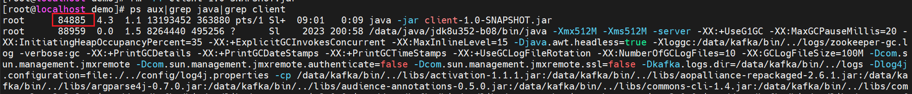
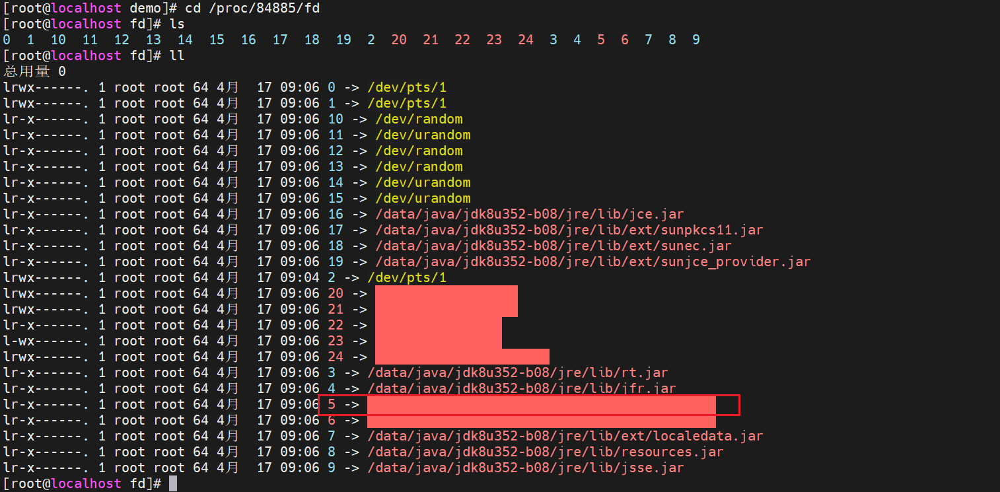


最近测试环境上的JAR包和配置文件被误删除了，导致系统不能正常访问。由于是在内网环境，导致删除恢复软件不能被正常安装，因此只能临时恢复正在执行的JAR包，保证系统能正常访问。


## 操作步骤

### 环境准备

1. 启用jar应用

```shell
java -jar client-1.0-SNAPSHOT.jar
```


2. 删除jar包

```shell
rm -rf client-1.0-SNAPSHOT.jar
```

### 恢复文件

1. 查询进程号

```shell
ps aux|grep java|grep client
```



2. 进入进程目录

```shell
# cd /proc/进程号/fd
cd /proc/84885/fd

# 查看文件信息
ls -l
```



3. 恢复执行文件

```shell
# 5是删除文件的映射文件
cat 5 > /root/demo/client-1.0-SNAPSHOT.jar

# 查看恢复结果
cd /root/demo
ls -lh
```


4. 查看结果

```shell
```

## Sheel脚本（批量恢复）

> 由于环境涉及的应用较多，我编写了恢复shell脚本，可以恢复目标目录的文件。

```shell
for pid in $(ps aux | grep java | awk '{ print $2 }'); do
  echo "Try to recover the files of $pid"
  for file in $(ls -l /proc/$pid/fd | awk '{print $9}'); do
    symlink_dir=$(ls -l /proc/$pid/fd/$file | awk '{print $11}')
    # 判断是否满足恢复的条件
    if [[ $symlink_dir =~ ^/data/soft/.*$ ]]; then
      if [ ! -d "$(dirname symlink_dir)" ]; then
        mkdir -p "$(dirname symlink_dir)"
      fi
      if [ ! -f "$symlink_dir" ]; then
        cat "/proc/$pid/fd/$file" > "$symlink_dir"
        echo "Copied $file to $symlink_dir"
      else
        echo "$file already exists in $symlink_dir. Skipping..."
      fi
    fi
  done
done
```

